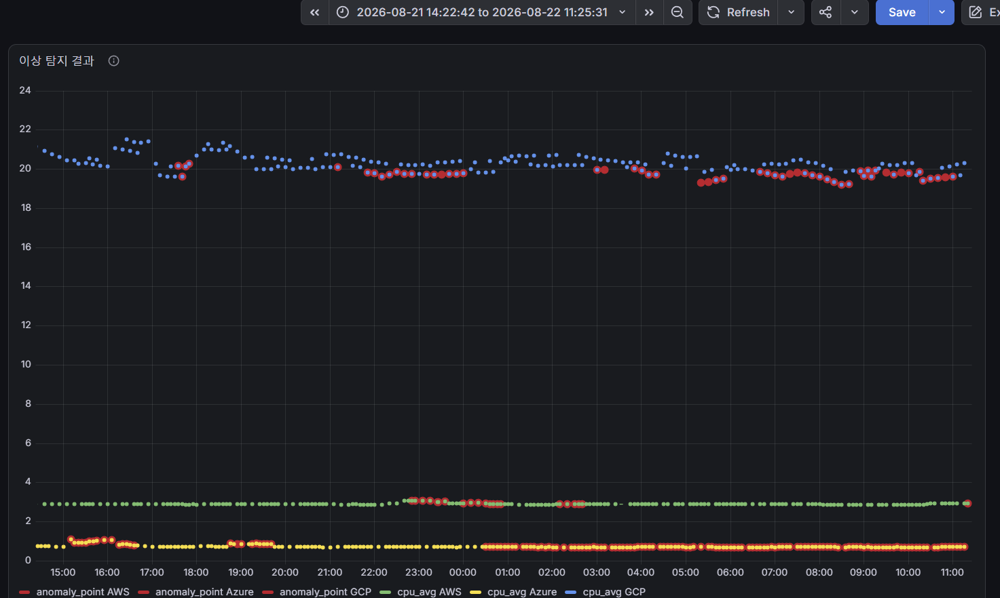
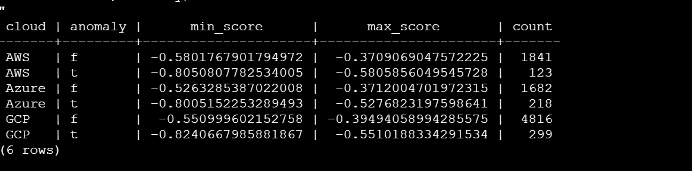

# 0009 — 이상탐지 판정 기준: "고정 비율" 방식에서 "통계 임계값" 방식으로 전환

## Context

INC-002에서 `ml/train.py`가 synthetic 데이터까지 섞어서 학습한 문제를 발견했고, A가 `source='real'` 필터 + 클라우드별 개별 모델 학습으로 고쳤다. 그런데 고친 뒤에도 이상한 점이 남아있었다.

- AWS·Azure는 CPU가 거의 안 움직이는 조용한 서버인데도, 여전히 꽤 자주 "이상"으로 찍혔다

  

- `anomaly_results`의 `score`를 뜯어보니, "정상"으로 분류된 것 중 제일 낮은 점수와 "이상"으로 분류된 것 중 제일 높은 점수의 차이가 AWS 0.001, Azure 0.002, GCP는 거의 0으로 **거의 붙어있었다** (전체 점수 범위는 0.3~0.4폭인데 그중 0.001~0.002 차이로 갈림)

  

- 원인은 `IsolationForest(contamination=0.05)` — "무조건 전체 데이터의 5%는 이상이라고 분류해라"는 강제 비율 설정. 진짜 이상이 5%보다 적어도, 모델은 억지로 5%를 채우다 보니 애매하게 조금 다른 값까지 이상으로 몰아넣고 있었다

## Decision

이상 여부 판정 기준을 **"전체 중 상위 N%" 같은 강제 비율 방식**에서, **클라우드별 real 데이터의 평균·표준편차 기반 통계 임계값 방식**으로 바꾼다.

```
이상 판정 기준 (안):
  cpu_avg가 해당 클라우드의 (평균 ± 3×표준편차) 범위를 벗어나면 이상
  (memory_avg, disk_avg도 동일한 방식으로 확장 가능)
```

Isolation Forest 자체를 없애는 건 아니고, `score`는 참고 지표로 계속 남겨두되, **최종 "이상이다/아니다" 판정은 이 통계 기준으로 한다.** 강제로 몇 %를 채워야 한다는 제약이 없어지므로, 진짜 조용한 기간엔 이상이 0건 나올 수도 있다 (오히려 그게 정상).

## Why

1. **우리 서버 특성과 "강제 비율"이 안 맞음** — 클라우드당 인스턴스 1개짜리 조용한 테스트 서버인데, "항상 5%는 위험"이라는 전제 자체가 현실과 다르다
2. **점수 차이로 증명됨** — 정상과 이상의 경계가 0.001~0.002 차이밖에 안 나는 건, 실제로 크게 다른 두 그룹이 아니라 억지로 나눈 결과라는 뜻
3. **실제 클라우드 플랫폼들도 강제 비율을 안 씀** — AWS CloudWatch, AWS Cost Anomaly Detection, Azure Cost Management, GCP 전부 "지금 이 시점에 예상되는 값" 대비 실제값이 얼마나 벗어났는지로 판단하지, "무조건 몇 %는 이상"이라는 방식을 쓰지 않는다 (아래 참고자료)
4. **우리 프로젝트 규모에 맞는 절충안** — AWS/Azure처럼 딥러닝 기반 계절성 예측 모델(WaveNet 등)을 만들 데이터량·기간이 안 되니, "예측 대비 이탈만 본다"는 핵심 원리만 가져와서 평균·표준편차 기반으로 훨씬 단순하게 구현한다

## 대안과의 비교

| 대안 | 내용 | 문제점 | 채택 여부 |
|------|------|--------|-----------|
| `contamination` 값만 낮추기 (0.05 → 0.02) | 강제 비율은 유지하되 숫자만 줄임 | 여전히 "무조건 몇 %"라는 강제 할당 방식 자체는 그대로라 근본 해결이 아님 | 미채택 |
| synthetic 데이터 기준으로 절대 임계값 설정 | synthetic의 "정상" 패턴 값을 기준선으로 사용 | synthetic 정상 평균(Azure 기준 59%)이 real 평균(0.82%)이랑 스케일이 완전히 달라서, 오히려 real의 진짜 이상을 못 잡게 됨 | 미채택 |
| AWS/Azure급 시계열 딥러닝(계절성 예측 모델) 도입 | WaveNet 등으로 시간대·요일 패턴까지 학습 | 최소 수십 일치 데이터와 딥러닝 인프라가 필요, 우리 프로젝트 기간·데이터량 초과 | 미채택 |
| **클라우드별 real 데이터 평균·표준편차 기반 통계 임계값** | 강제 비율 없이, 절대적인 "정상 범위"를 벗어날 때만 이상 판정 | 계절성(시간대별 차이)까지는 반영 못 함 — 다만 지금 우리 서버엔 뚜렷한 시간대 패턴이 없어서 지금 단계에선 무리 없음 | **채택** |

## Result

*(구현 전 — A와 협의 후 `ml/train.py`/`ml/anomaly_detector.py` 반영 예정. 반영 후 재학습·재탐지 결과를 이 섹션에 업데이트할 것)*

- [o] `ml/anomaly_detector.py`에 평균±3σ 기반 판정 로직 추가
- [o] 재탐지(`--full`) 실행 후 클라우드별 이상 비율 재확인
- [o] AWS/Azure의 "거의 매 순간 이상" 현상이 사라지는지 확인
- [o] 필요시 σ 배수(3배 등)를 조정하며 재검증

## 참고자료

- [Using CloudWatch anomaly detection - AWS 공식 문서](https://docs.aws.amazon.com/AmazonCloudWatch/latest/monitoring/CloudWatch_Anomaly_Detection.html)
- [What is AWS Cost Anomaly Detection](https://www.hava.io/blog/what-is-aws-cost-anomaly-detection)
- [Identify anomalies and unexpected changes in cost - Microsoft Learn (Azure)](https://learn.microsoft.com/en-us/azure/cost-management-billing/understand/analyze-unexpected-charges)
- [Introducing Cost Anomaly Detection - Google Cloud Blog](https://cloud.google.com/blog/topics/cost-management/introducing-cost-anomaly-detection/)
- 관련 문서: [INC-002](../incidents/INC-002.md), [0003-synthetic-data-generation](0003-synthetic-data-generation.md)
