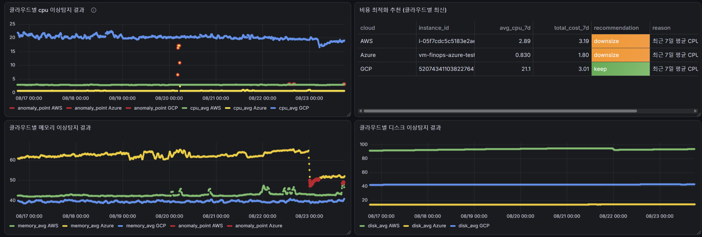
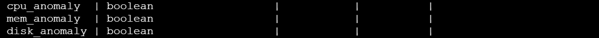
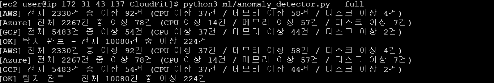

# 0010 — 이상탐지 결과를 지표별로 분리 (cpu_anomaly / mem_anomaly / disk_anomaly)

## Context

decisions/0009로 CPU에 평균±3σ 판정을 도입한 뒤, 이어서 메모리·디스크까지 같은 방식(OR 조건)으로 확장했다(`train.py`에 mem_mean/std, disk_mean/std 추가, `anomaly_detector.py`에서 `cpu_out | mem_out | disk_out`).

근데 `anomaly_results`에 판정 결과가 `anomaly` 컬럼 하나뿐이라, 셋 중 뭐 하나만 이상이어도 CPU/메모리/디스크 패널 전부에 같은 시각 빨간 점이 동시에 찍히는 문제를 발견했다. CPU/메모리/디스크를 패널로 나눈 이유 자체가 "뭐가 문제인지 빨리 찾기 위해서"였는데, 지금 구조로는 세 그래프를 다 열어서 어느 라인이 실제로 튀었는지 눈으로 비교해야만 원인을 알 수 있어서 비효율적이었다.

## Decision

`anomaly_results`에 `cpu_anomaly`/`mem_anomaly`/`disk_anomaly` 컬럼을 추가한다. 기존 `anomaly` 컬럼은 "셋 중 하나라도 이상"인 종합 판정(요약용)으로 그대로 남겨두고, `anomaly_detector.py`에서 세 지표를 각각 독립적으로 평균±3σ 판정해서 개별 컬럼에 저장한다. Grafana 각 패널의 이상탐지 오버레이 쿼리는 `anomaly = true` 대신 그 패널에 맞는 지표 컬럼(`cpu_anomaly` / `mem_anomaly` / `disk_anomaly`)으로 필터링한다.

## Why

1. **패널을 나눈 목적과 맞아야 함** — CPU/메모리/디스크를 각각 다른 패널로 만든 이유가 "지표별로 빠르게 원인 찾기"였는데, 종합 판정 하나만 쓰면 그 목적이 안 살아남
2. **실제 플랫폼들도 지표마다 독립적으로 판단함** — AWS CloudWatch는 메트릭 하나 + 통계값 하나마다 별도 anomaly detector를 만들고, Datadog·New Relic도 CPU/메모리/디스크를 각각 별도 지표로 놓고 이상을 탐지함. 우리가 하려는 방식(지표별 독립 판단)이 업계 방식이랑 같은 원리
3. **구현 부담이 크지 않음** — `anomaly_detector.py`에 이미 `cpu_out`/`mem_out`/`disk_out`을 각각 계산하고 있었어서, OR로 합치기 전 값을 그대로 저장만 하면 됨. 새로 계산할 게 없음

## 대안과의 비교

| 대안 | 내용 | 문제점 | 채택 여부 |
|------|------|--------|-----------|
| 현행 유지 (`anomaly` 컬럼 하나) | 그대로 둠 | 패널 나눈 의미가 없어짐, 원인 파악하려면 세 그래프를 계속 비교해야 해서 비효율적 | 미채택 |
| 지표마다 별도 테이블 생성 | `cpu_anomaly_results`, `mem_anomaly_results`, `disk_anomaly_results`로 분리 | 테이블이 3개로 늘어나 관리 복잡해지고, 조회할 때마다 조인이 필요해짐 | 미채택 |
| **기존 테이블에 컬럼만 추가** | `anomaly_results`에 `cpu_anomaly`/`mem_anomaly`/`disk_anomaly` 컬럼만 추가 | 테이블 구조 단순 유지, 기존 쿼리 구조도 거의 그대로 재사용 가능 | **채택** |

## Result

- [x] `schema.sql` + 실제 DB에 `cpu_anomaly`/`mem_anomaly`/`disk_anomaly` 컬럼 3개 추가, `\d anomaly_results`로 확인

  

- [x] `anomaly_detector.py`에서 지표별 개별 판정 후 저장. `--full` 재실행 로그로 확인 (AWS 92건=CPU 37/메모리 58/디스크 4, Azure 78건, GCP 54건)

  

## 참고자료

- [Using CloudWatch anomaly detection - AWS 공식 문서](https://docs.aws.amazon.com/AmazonCloudWatch/latest/monitoring/CloudWatch_Anomaly_Detection.html)
- [How to Monitor AWS Resources Using New Relic](https://www.frugaltesting.com/blog/how-to-monitor-aws-resources-using-new-relic-a-comprehensive-guide-for-cloud-engineers)
- [Anomaly Monitor - Datadog Docs](https://docs.datadoghq.com/monitors/types/anomaly/)
- 관련 문서: [decisions/0009](0009-anomaly-threshold-method.md)