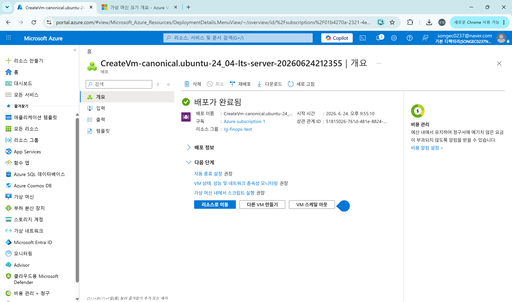
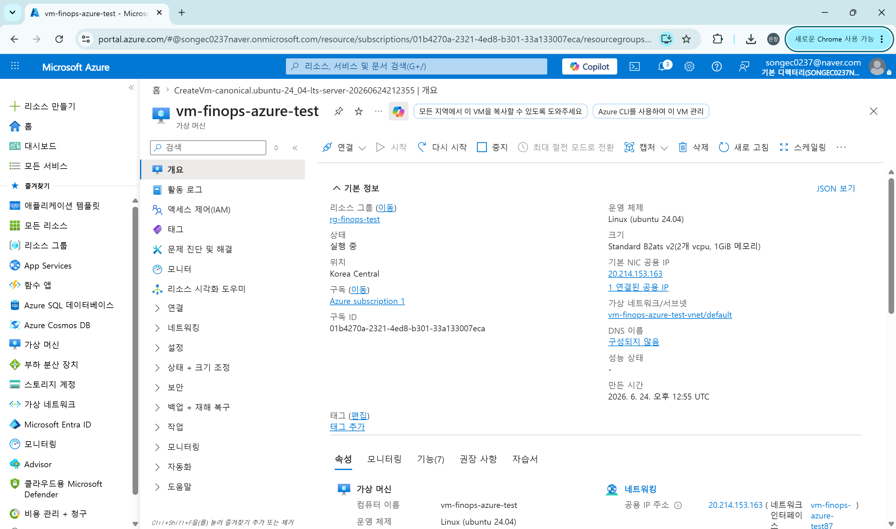
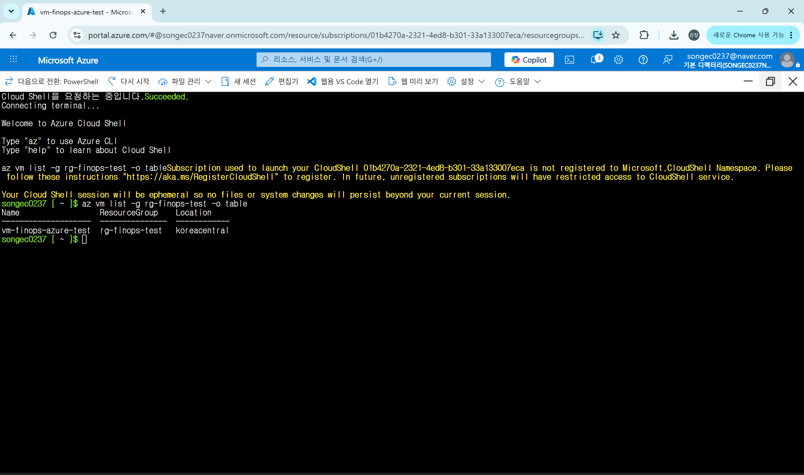

# 2026-06-24 — Day 01

## 오늘 목표

* Azure 프로젝트용 계정을 생성하고 Azure Portal 로그인을 확인한다.
* Azure 리소스 그룹을 생성한다.
* 테스트용 Azure VM을 생성하고 실행 상태를 확인한다.
* Azure CLI 명령어로 VM 목록을 확인한다.
* 비용 절약을 위해 작업 종료 후 VM을 중지(할당 취소)한다.

---

## 오늘 한 일

* 프로젝트용 일반 Microsoft 계정으로 Azure Portal에 로그인했다.
* Azure Portal에서 리소스 그룹 `rg-finops-test`를 생성했다.

  * 지역: `Korea Central`
* 테스트용 VM `vm-finops-azure-test`를 생성했다.

  * 운영체제: `Ubuntu Server 24.04 LTS`
  * 지역: `Korea Central`
  * 크기: `Standard B2ats v2`
  * 인증 방식: `SSH 공개 키`
  * 사용자 이름: `azureuser`
  * 인바운드 포트: `SSH(22)`
* VM 생성 과정에서 SSH 프라이빗 키를 다운로드했다.
* Azure Cloud Shell에서 `az vm list` 명령어를 실행하여 VM 목록이 출력되는 것을 확인했다.
* 작업 종료 후 비용 절약을 위해 VM을 중지(할당 취소)했다.

---

## 왜 이 기술/방법을 선택했는가

| 항목       | 선택한 것                           | 대안                               | 선택 이유                                                                        |
| -------- | ------------------------------- | -------------------------------- | ---------------------------------------------------------------------------- |
| 리소스 그룹   | `rg-finops-test`                | 리소스별 개별 관리                       | VM, 네트워크, 디스크 등을 하나의 단위로 묶어 관리하기 위해                                          |
| 지역       | `Korea Central`                 | `Korea South`                    | 팀 계획과 맞추고, 국내 리전에서 테스트 VM을 운영하기 위해                                           |
| VM 이미지   | `Ubuntu Server 24.04 LTS`       | Windows Server, Ubuntu 22.04 LTS | Linux 기반 수집기 테스트와 SSH 접속 실습에 적합하기 때문에                                        |
| VM 크기    | `Standard B2ats v2`             | Standard B1s, D2s_v3             | B1s는 현재 구독/리전에서 사용 불가했고, D 계열은 테스트용으로 비용이 커서 B 시리즈 중 저렴한 크기를 선택함             |
| OS 디스크   | 표준 SSD LRS                      | 프리미엄 SSD LRS, 표준 HDD LRS         | 테스트용 VM이므로 고성능 디스크보다 비용 절약이 중요하고, 표준 HDD보다는 안정적인 표준 SSD가 적절하다고 판단함           |
| 인증 방식    | SSH 공개 키                        | 암호 로그인                           | 보안성이 더 좋고, Linux VM 접속 방식으로 일반적으로 사용되기 때문                                    |
| 확인 방법    | Azure Cloud Shell의 `az vm list` | Azure Portal 화면 확인만 사용           | 포털 화면뿐 아니라 명령어로 VM이 조회되는 것을 확인해야 이후 수집기 자동화 작업으로 이어질 수 있기 때문                 |
| 종료 방식    | 중지(할당 취소)                       | 그냥 브라우저 종료, VM 삭제                | 브라우저 종료는 VM 실행 상태를 멈추지 않으므로 비용이 계속 발생할 수 있고, 삭제는 이후 테스트 대상이 사라지므로 할당 취소를 선택함 |

---

## 오늘 처음 안 사실

| 몰랐던 것                      | 알게 된 것                                                           | 왜 그렇게 되는지                                                       |
| -------------------------- | ---------------------------------------------------------------- | --------------------------------------------------------------- |
| 리소스 그룹의 역할                 | 리소스 그룹은 VM, 네트워크, 디스크 등을 묶는 관리 단위이다                              | 같은 프로젝트에서 만든 리소스를 한 번에 찾고 관리하거나 삭제할 수 있게 하기 위해 사용한다             |
| VM 크기 오류                   | 특정 VM 크기는 구독과 리전에 따라 사용할 수 없을 수 있다                               | Azure는 지역별 자원 수량과 구독별 할당량 제한이 있어서 모든 크기를 항상 만들 수 있는 것은 아니다      |
| VM 월 비용 표시                 | 화면의 월 비용은 즉시 차감되는 금액이 아니라 계속 실행했을 때의 예상 비용이다                     | Azure VM은 주로 실행 시간 기준으로 비용이 계산되기 때문이다                           |
| 프리미엄 SSD와 표준 SSD 차이        | 프리미엄 SSD는 성능은 좋지만 테스트용에는 과할 수 있다                                 | 이번 VM은 실제 서비스 운영이 아니라 CPU 수집 테스트 대상이므로 고성능 디스크가 필수는 아니다         |
| SSH 공개 키                   | VM 접속을 위해 공개 키/개인 키 쌍을 사용할 수 있다                                  | 공개 키는 VM에 등록되고, 개인 키는 사용자가 보관하여 접속 인증에 사용된다                     |
| Cloud Shell 경고             | Cloud Shell 사용 시 `Microsoft.CloudShell` Namespace 관련 경고가 나올 수 있다 | 처음 사용하는 구독에서는 Cloud Shell 관련 리소스 공급자가 아직 등록되지 않았을 수 있기 때문이다     |
| VM 중지와 할당 취소               | 단순히 화면을 닫는 것이 아니라 VM을 중지(할당 취소)해야 컴퓨팅 비용을 줄일 수 있다                | 실행 중인 VM은 컴퓨팅 자원을 점유하므로 비용이 발생하지만, 할당 취소 상태는 컴퓨팅 자원 점유가 해제된다    |

---

## 결과·증거

* 캡처: `evidence/day01-azure-vm-deploy-ok.png`

* 캡처: `evidence/day01-azure-vm-running-ok.png`

* 캡처: `evidence/day01-azure-vm-list-ok.png`


### 확인한 명령어

```bash
az vm list -g rg-finops-test -o table
```

### 확인 결과

```text
Name                  ResourceGroup    Location
--------------------  ---------------  ------------
vm-finops-azure-test  rg-finops-test   koreacentral
```

### VM 최종 상태

* VM 이름: `vm-finops-azure-test`
* 리소스 그룹: `rg-finops-test`
* 지역: `Korea Central`
* 최종 상태: `중지됨(할당 취소됨)`

---

## 막힌 점

* `Standard_B1s` 크기가 Korea Central에서 사용할 수 없다는 오류가 발생했다.

  * 같은 B 시리즈 중 사용 가능한 `Standard_B2ats_v2`로 변경하여 해결했다.
* VM 생성 시 디스크가 기본값으로 프리미엄 SSD로 설정되어 있었다.

  * 테스트용 VM이므로 표준 SSD LRS로 변경했다.
* Cloud Shell 첫 실행 시 `Microsoft.CloudShell` Namespace 관련 경고가 표시되었다.

  * 임시 세션으로는 명령어 실행이 가능하여 `az vm list` 확인은 정상 진행했다.

---
