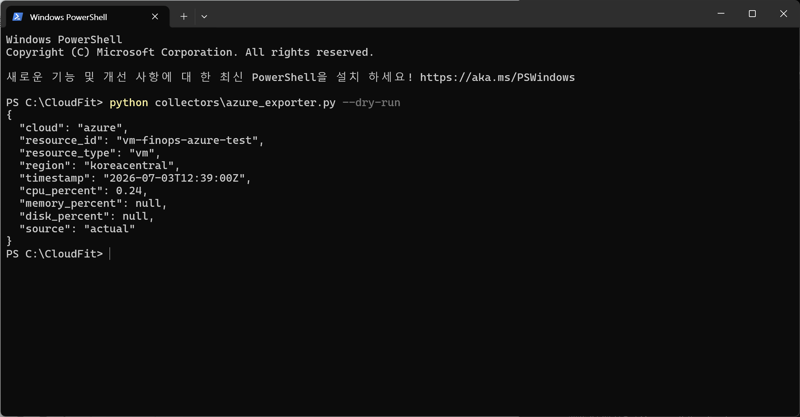
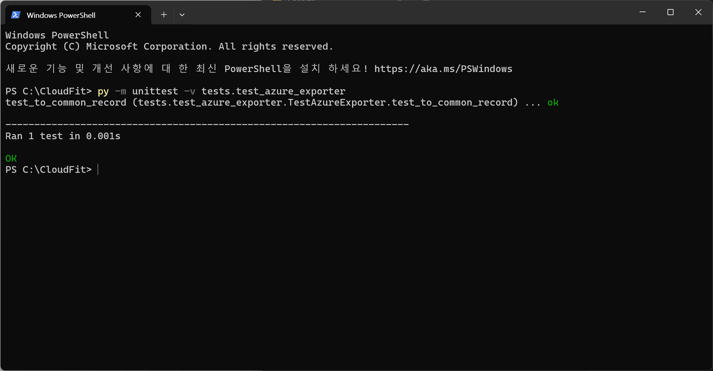

# 2026-07-03 — Day 04

## 오늘 목표
- Azure Monitor CPU 조회 실험 코드를 정식 수집 모듈 `collectors/azure_exporter.py`로 정리한다.
- `--dry-run` 옵션으로 Azure VM CPU 메트릭을 공통 JSON 형식으로 출력한다.
- `to_common_record()` 함수 단위 테스트를 작성한다.
- Azure 수집기 실행 절차를 `runbook/azure-collector-setup.md`에 문서화한다.

## 오늘 한 일
- `collectors/azure_exporter.py` 작성
  - `.env`에서 Azure 인증 정보 로드
  - `ClientSecretCredential`을 사용한 Service Principal 인증 구성
  - Azure Monitor API로 `Percentage CPU` 메트릭 조회
  - Azure VM resource URI 생성
  - 최근 30분 범위의 CPU 메트릭 조회
  - 최신 CPU datapoint를 선택해 공통 형식으로 변환
  - `--dry-run` 옵션 추가

- `python collectors\azure_exporter.py --dry-run` 실행
  - Azure Monitor API 호출 성공
  - 공통 JSON 형식 출력 성공
  - 출력 예시:

    {
      "cloud": "azure",
      "resource_id": "vm-finops-azure-test",
      "resource_type": "vm",
      "region": "koreacentral",
      "timestamp": "2026-07-03T12:39:00Z",
      "cpu_percent": 0.24,
      "memory_percent": null,
      "disk_percent": null,
      "source": "actual"
    }

- `tests/test_azure_exporter.py` 작성
  - `to_common_record()` 함수가 필요한 공통 필드만 남기는지 검증
  - 내부용 필드인 `metric_name`이 제거되는지 확인

- 단위 테스트 실행

    py -m unittest -v tests.test_azure_exporter

- 단위 테스트 결과

    test_to_common_record (tests.test_azure_exporter.TestAzureExporter.test_to_common_record) ... ok

    ----------------------------------------------------------------------
    Ran 1 test in 0.001s

    OK

- `runbook/azure-collector-setup.md` 작성
  - 실행 목적
  - 대상 파일
  - 환경변수 설정
  - Python 패키지 설치 방법
  - dry-run 실행 방법
  - 정상 출력 예시
  - 출력 필드 의미
  - 단위 테스트 실행 방법
  - 오류 증상과 복구 방법
  - 다음 확장 작업 정리

## 왜 이 기술/방법을 선택했는가

| 항목 | 선택한 것 | 대안 | 선택 이유 |
|------|-----------|------|-----------|
| Azure API 호출 | Azure Monitor SDK | Azure CLI, Azure Portal 수동 확인 | 자동 수집 모듈로 만들기 위해 Python 코드에서 직접 API를 호출해야 하기 때문 |
| 인증 방식 | Service Principal + ClientSecretCredential | 개인 계정 `az login` | 사람이 직접 로그인하지 않아도 수집기가 API를 호출할 수 있기 때문 |
| 실행 검증 | `--dry-run` | 바로 서버/DB 전송 | 아직 중앙 서버 연동 전이므로 수집 결과를 화면에서 먼저 확인하는 것이 안전하기 때문 |
| 출력 형식 | 공통 JSON 형식 | Azure SDK 원본 객체 그대로 사용 | AWS/GCP 수집기와 같은 필드명으로 통합하기 위해 필요하기 때문 |
| 테스트 방식 | `unittest` | 수동 출력 확인만 진행 | `to_common_record()`가 필요한 필드만 남기는지 반복 검증할 수 있기 때문 |
| 문서화 | Runbook 작성 | 코드 주석만 작성 | 나중에 팀원이나 내가 같은 절차를 재현할 수 있어야 하기 때문 |

## 오늘 처음 안 사실

| 몰랐던 것 | 알게 된 것 | 왜 그렇게 되는지 |
|-----------|-----------|----------------|
| `__pycache__` 폴더 | Python 실행 시 자동으로 생기는 캐시 폴더 | Python이 `.py` 파일을 빠르게 실행하기 위해 `.pyc` 파일을 생성하기 때문 |
| 단위 테스트의 역할 | 실제 Azure API 호출이 아니라 함수 하나의 동작을 검증할 수 있음 | 작은 단위의 함수가 기대한 결과를 내는지 독립적으로 확인하기 위해 사용함 |
| `to_common_record()`의 의미 | Azure 원본 데이터에서 공통 필드만 남기는 함수 | AWS/Azure/GCP 데이터를 같은 스키마로 맞추기 위해 필요함 |
| `python`과 `py` 명령 차이 | `python` 명령은 환경에 따라 이상하게 연결될 수 있고, `py`로 정상 실행되는 경우가 있음 | Windows에서 Python Launcher가 별도로 동작하기 때문 |
| Runbook의 역할 | 오늘 한 일을 기록하는 Diary와 다르게, 재현 가능한 실행 절차를 정리하는 문서 | 나중에 같은 수집기를 다시 설치·실행·복구할 수 있게 하기 위해 필요함 |
| PowerShell 한글 깨짐 | 파일이 깨진 것이 아니라 터미널 출력 인코딩 문제일 수 있음 | 메모장에서 정상으로 보이면 파일 자체는 정상이고, PowerShell 출력 설정 문제일 가능성이 큼 |

## 결과·증거
- 캡처: `evidence/day04-azure-exporter-dry-run-ok.png`

- 캡처: `evidence/day04-azure-exporter-unit-test-ok.png`

- Runbook 작성 완료: `runbook/azure-collector-setup.md`

## 막힌 점
- `python -m unittest tests.test_azure_exporter` 실행 시 `Python` 한 줄만 출력되고 테스트 결과가 나오지 않았다.
  - 원인: Windows에서 `python` 명령 연결이 정상적으로 unittest 실행을 처리하지 못한 것으로 보인다.
  - 복구: `py -m unittest -v tests.test_azure_exporter`로 실행하여 테스트 성공을 확인했다.

- PowerShell에서 `type runbook\azure-collector-setup.md` 실행 시 한글이 깨져 보였다.
  - 원인: 파일 자체 문제라기보다 PowerShell 출력 인코딩 문제로 판단했다.
  - 복구: 메모장에서 정상 표시되는 것을 확인했고, Runbook 작성은 완료로 판단했다.

- 메모리와 디스크 사용률은 아직 수집하지 못했다.
  - 이유: Azure VM의 CPU는 기본 메트릭으로 조회 가능하지만, 메모리/디스크 사용률은 Azure Monitor Agent 설정이 필요할 수 있기 때문이다.
  - 다음 단계에서 Azure Monitor Agent 또는 관련 메트릭 설정을 확인해야 한다.

## 혼자 다시 할 수 있나? (커밋 전 자문)
- [ ] Yes → 커밋
- [ ] No → 막힌 부분을 위 섹션에 기록 후 커밋