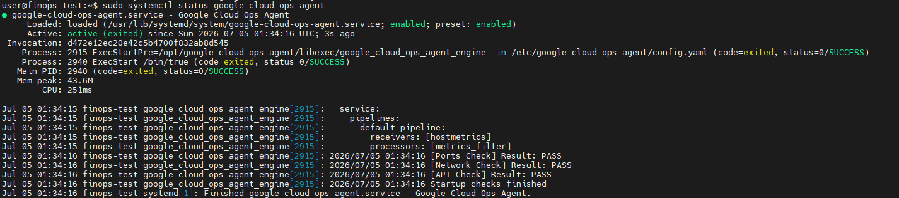
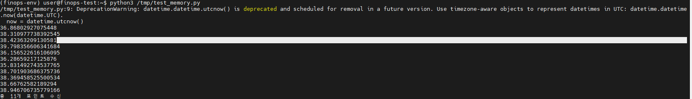
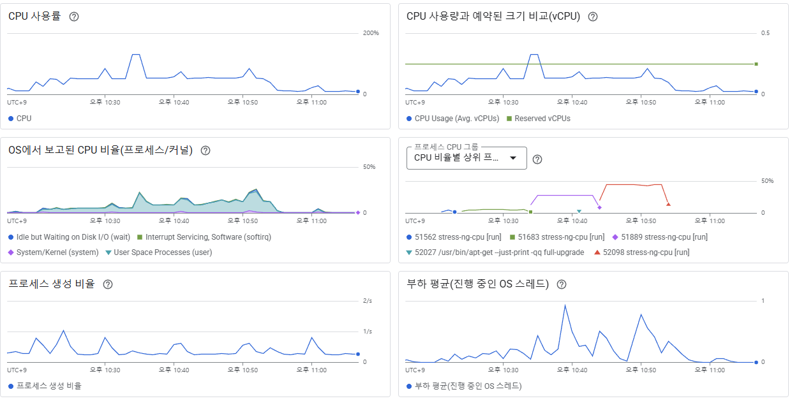

# 2026-07-05 — Day 03 (GCP 담당)

## 오늘 목표
- Ops Agent 설치해서 메모리/디스크 수집 가능하게 만들기
- 인스턴스 사양 수집 + 공통 형식 변환 함수(`to_common_record`) 완성
- 단위 테스트 작성 + stress-ng 부하 패턴 검증

## 오늘 한 일
- Ops Agent 설치 → 최초 `API Check FAIL`(권한 부족) 확인
- 개인 계정에 실수로 IAM 역할 부여 → 효과 없음 확인 → VM 실제 서비스 계정(`1046021578827-compute@developer.gserviceaccount.com`) 찾아서 재작업 → `API Check PASS`
- 메모리 수집 코드 작성 (`state="used"` 필터 적용 전/후 비교, 45개 → 11개로 정상화)
- 디스크 수집 코드 작성 (`device="/dev/sda1"`, `state="used"` 필터, `df -h`로 42% vs 38.92% 대조 검증)
- 인스턴스 사양 수집 코드 작성 (`google-api-python-client` 신규 설치, `compute.instances.get()` 사용, `403 Forbidden` → `Compute Viewer` 권한 추가로 해결)
- `to_common_record()` 최종 구현 (CPU/메모리/디스크 평균 계산 + `MACHINE_SPECS` 매핑, `--dry-run` 출력 확인)
- 단위 테스트 4개 작성 및 통과 (`tests/test_gcp_exporter.py`)
- stress-ng 3단계(10%/55%/90%, 각 10분) 백그라운드 실행 → 로그 및 Cloud Monitoring 프로세스별 CPU 그래프로 순서대로 실행됐음을 확인

## 왜 이 기술/방법을 선택했는가

| 항목 | 선택한 것 | 대안 | 선택 이유 |
|------|-----------|------|-----------|
| 메모리/디스크 수집 | Ops Agent 설치 | 직접 `/proc` 파싱 | Cloud Monitoring과 통합되어 API로 바로 조회 가능 |
| IAM 권한 대상 | VM 서비스 계정 | 개인 계정 | VM 안 코드/에이전트는 메타데이터 서버로 서비스 계정만 자동 인증함 |
| 인스턴스 사양 조회 | `google-api-python-client` (`discovery.build`) | `google-cloud-compute` | 계획서 예시와 통일, Compute Engine API는 discovery 방식이 표준적 |
| 디스크 device 선택 | `/dev/sda1` (루트) | `/dev/sda15` (EFI 부팅) | 실제 데이터가 쌓이는 파티션만 저활용/부족 판단에 의미 있음 |
| stress-ng 실행 방식 | `nohup` 백그라운드 | 포그라운드 대기 | 30분 동안 터미널 붙잡혀 있을 필요 없이 다른 작업 병행 가능 |

## 오늘 처음 안 사실

| 몰랐던 것 | 알게 된 것 | 왜 그렇게 되는지 |
|-----------|-----------|----------------|
| 개인 계정에 역할 주면 되는 줄 알았음 | VM 서비스 계정과 개인 계정은 완전히 다른 인증 주체 | VM 코드는 메타데이터 서버로 서비스 계정만 자동 인증함 |
| memory/disk `percent_used`가 값 하나만 주는 줄 알았음 | `state` 라벨로 메모리는 5가지, 디스크는 3가지로 나뉘어 나옴 | 하나의 리소스를 여러 상태로 쪼개 표현하는 방식이라 필터링 안 하면 다 섞여 나옴 |
| `discovery.build`와 `monitoring_v3`가 같은 패키지인 줄 알았음 | GCP 클라이언트 라이브러리는 두 계열(`google-cloud-*`, `google-api-python-client`)로 나뉨 | 서비스마다 지원하는 라이브러리 방식이 다름 |
| stress-ng가 목표 %를 정확히 유지해줄 거라 생각함 | 기본 `--cpu-method all`은 부하가 들쭉날쭉해서 계단이 아니라 스파이크 형태로 나타남 | 여러 계산 알고리즘을 번갈아 쓰는 방식이라 부하가 일정하게 유지되지 않음 |
| CPU 그래프만 보고 검증하려 함 | "프로세스 CPU 그룹" 패널에서 PID로 각 단계를 직접 대조하는 게 더 확실한 증거 | Cloud Monitoring이 프로세스별로 라벨을 붙여서 시간대별 실행 순서를 그대로 보여줌 |

## 결과·증거

Ops Agent 권한 실패/복구:



메모리 수집 정상 확인:




`to_common_record()` 최종 출력:

```
{'cloud': 'GCP', 'instance_id': '5207434110382276471', 'timestamp': '2026-07-05T02:38:09.077822+00:00', 'cpu_avg': 13.97, 'memory_avg': 39.06, 'disk_avg': 39.18, 'instance_type': 'e2-micro', 'vcpu': 2, 'ram_gb': 1, 'cost_monthly': None}
```

stress-ng 3단계 실행 확인 (프로세스 PID로 순서 대조):



## 막힌 점
- Ops Agent 설치 직후 `API Check FAIL` → 권한(`monitoring.metricWriter`, `logging.logWriter`) 부족
- IAM 역할을 개인 계정에 잘못 부여 → VM 서비스 계정 재확인 후 정정
- 인스턴스 사양 조회 시 `403 Forbidden` → `Compute Viewer` 권한 추가로 해결
- stress-ng 기본 방식으로는 목표 %가 정확히 유지되지 않아 그래프가 계단이 아닌 스파이크로 나타남 → 프로세스 PID 대조로 검증 방식 변경
