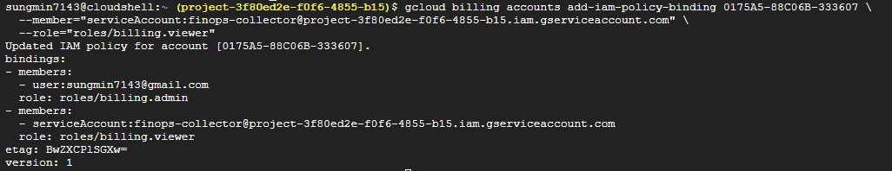
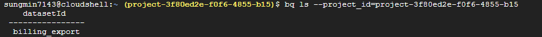
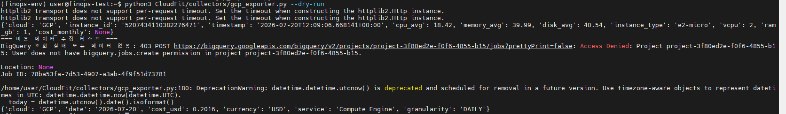

# 2026-07-20 — Week3 (GCP 담당)

## 오늘 목표
- 서비스 계정에 결제 조회 권한(billing.viewer) 추가
- BigQuery billing export 활성화
- collect_cost() / to_common_cost_record() 함수 작성
- 단위 테스트 작성

## 오늘 한 일
- 서비스 계정(finops-collector)에 `roles/billing.viewer` 추가 시도 → 개인(비조직) 결제 계정이라 콘솔 UI에서 권한 화면 자체가 안 보이는 것 확인 → Cloud Shell에서 `gcloud billing accounts add-iam-policy-binding`으로 우회 성공
- 이 과정에서 VM SSH 터미널과 진짜 Cloud Shell의 인증 주체가 다르다는 걸 재확인 (VM SSH = VM 서비스 계정으로 자동 인증, PERMISSION_DENIED 발생)
- BigQuery billing export 활성화: "표준 사용량 비용" 옵션 선택, `billing_export` 데이터셋 생성 시도 → `bigquery.datasets.create` 권한 부족 → 개인 계정에 `bigquery.admin` 역할 추가 후 해결
- `collect_cost()`, `to_common_cost_record()`, `estimate_daily_cost()`, `GCP_PRICING` 작성
- `--dry-run` 실행 중 함수 누락/중복 여러 차례 디버깅 (`to_common_cost_record`, `estimate_daily_cost`가 파일에 실제로 저장 안 된 상태로 여러 번 재발 → 파일 전체 정리 후 해결)
- 최종 실행: BigQuery 조회는 VM 서비스 계정 권한 부족으로 실패(예상된 동작) → `except`로 넘어가 추정값 기반 레코드 정상 출력 확인
- 단위 테스트 2개 추가 (`test_cost_record_cloud_is_gcp`, `test_estimate_daily_cost_e2_micro`) → 기존 4개 포함 총 6개 통과

## 왜 이 기술/방법을 선택했는가

| 항목 | 선택한 것 | 대안 | 선택 이유 |
|------|-----------|------|-----------|
| 권한 부여 방식 | Cloud Shell + `gcloud` 명령어 | 콘솔 UI 클릭 | 개인(비조직) 결제 계정은 콘솔 IAM 화면이 제한적이라 CLI가 유일하게 확실한 경로 |
| BigQuery export 종류 | 표준 사용량 비용 | 자세한 사용량 비용 / FOCUS(프리뷰) | 날짜별 합산 수준이면 충분, 프리뷰 기능은 아직 불안정 |
| 데이터 없을 때 처리 | `try/except`로 추정값 자동 대체 | 에러 발생시키고 수동 처리 | export가 최대 하루 지연되므로, 그 사이 파이프라인이 끊기지 않게 함 |
| BigQuery 데이터 위치 | asia-northeast3(서울) | US 멀티리전 | VM과 같은 리전으로 통일해 나중 리전 간 쿼리 문제 방지 |

## 오늘 처음 안 사실

| 몰랐던 것 | 알게 된 것 | 왜 그렇게 되는지 |
|-----------|-----------|----------------|
| 조직 관리자면 모든 권한이 있는 줄 알았음 | GCP는 서비스별(Compute/BigQuery/Billing)로 권한이 완전히 분리됨 | 각 서비스가 독립된 IAM 정책 체계를 가짐 |
| VM SSH도 Cloud Shell이랑 같은 줄 알았음 | VM SSH = VM 서비스 계정 인증, Cloud Shell = 개인 계정 인증 | 인증 주체가 완전히 다른 창구 |
| 프로젝트 소유자면 BigQuery 데이터셋도 바로 만들 수 있는 줄 알았음 | `bigquery.datasets.create`는 별도 권한(BigQuery Admin 등) 필요 | Compute/조직 관리 권한과 BigQuery 권한은 무관 |

## 결과·증거

IAM 권한 추가 (Cloud Shell에서 billing.viewer 부여 성공):

BigQuery billing export 데이터셋 생성 확인:

비용 레코드 첫 출력 (--dry-run):

{'cloud': 'GCP', 'date': '2026-07-20', 'cost_usd': 0.2016, 'currency': 'USD', 'service': 'Compute Engine', 'granularity': 'DAILY'}

## 막힌 점
- 개인 결제 계정 콘솔에서 IAM/권한 화면을 못 찾아 여러 화면을 헤맴 → Cloud Shell CLI로 우회
- VM SSH에서 시도한 명령어가 PERMISSION_DENIED로 실패 (VM 서비스 계정 인증 문제, Day03과 동일 패턴 재발)
- BigQuery 데이터셋 생성 권한 부족 → `bigquery.admin` 역할 추가로 해결
