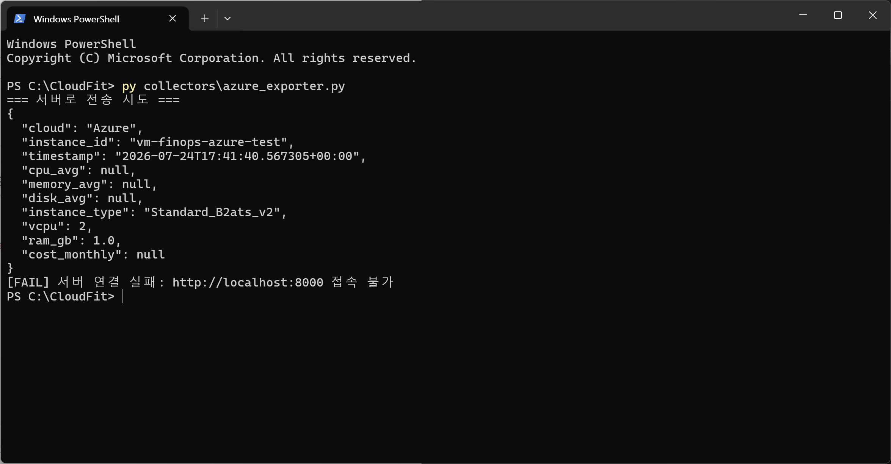
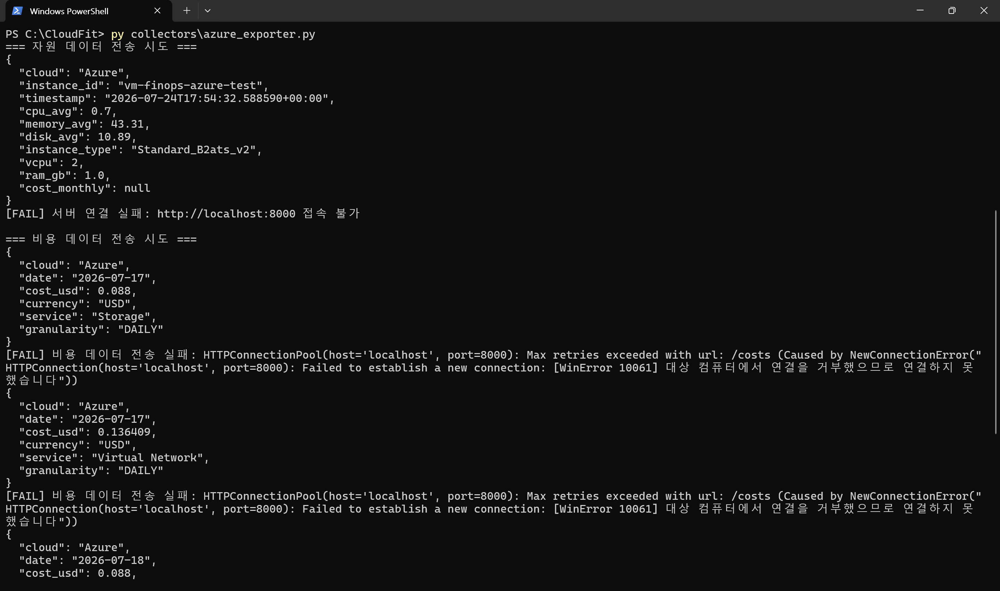
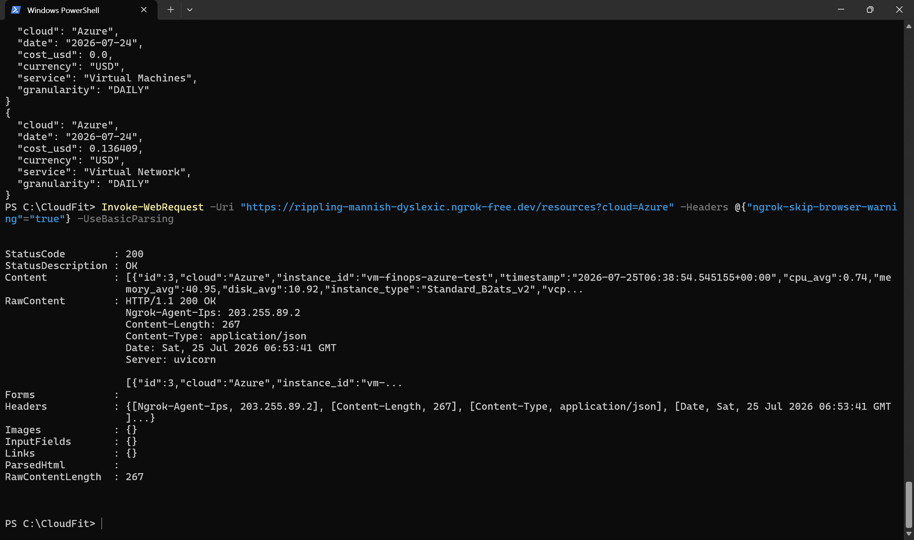

# 2026-07-25 — Week04 Day01~02 (B)

## 오늘 목표
- 기존 --dry-run 전용 azure_exporter.py에 실제 중앙 서버(FastAPI) 전송 기능 추가
- requirements.txt 신규 생성 및 requests 패키지 반영
- A의 서버(ngrok) 연결 후 자원·비용 데이터가 실제로 DB에 저장되는지 확인

---

### 1. requirements.txt 신규 생성

프로젝트에 requirements.txt 파일 자체가 없었던 것을 확인했다.

```powershell
py -m pip freeze > requirements.txt
```

생성된 requirements.txt에 다음이 포함된 것을 확인했다.

```text
requests==2.34.2
azure-identity==1.25.3
azure-mgmt-compute==38.1.0
azure-mgmt-costmanagement==5.0.0
azure-mgmt-monitor==7.0.0
azure-monitor-query==2.0.0
python-dotenv==1.2.2
...
```

---

### 2. 서버 전송 함수 구현

`azure_exporter.py`에 다음 함수 2개를 추가했다.

```text
send_resource_to_server()
send_cost_to_server()
```

`requests.post()`로 중앙 서버 API(`/resources`, `/costs`)에 데이터를 전송하며, 다음 예외를 구분하여 처리하도록 구현했다.

```text
requests.exceptions.ConnectionError
→ 서버 자체에 접속할 수 없는 경우 (서버 미기동)

기타 Exception
→ 그 외 예기치 못한 오류
```

---

### 3. run_send() 함수 신규 작성 및 main() 분기 처리

기존 `run_dry_run()`은 터미널 출력 전용으로 유지하고, 서버 전송 전용 함수 `run_send()`를 새로 작성했다.

```text
run_dry_run() → 데이터 수집 후 print만 수행
run_send()    → 데이터 수집 후 서버로 실제 전송
```

`main()`에서 `--dry-run` 여부에 따라 두 함수 중 하나를 실행하도록 분기 처리했다.

```python
if args.dry_run:
    run_dry_run()
else:
    run_send()
```

---

### 4. 서버 미기동 상태에서 1차 검증

서버가 없는 상태에서 `--dry-run` 없이 실행하여 자원 데이터 전송을 시도했다.

```powershell
py collectors\azure_exporter.py
```

CPU, 메모리, 디스크 값이 정상 수집된 것을 확인했고, 서버가 없으므로 다음 메시지가 정상 출력되는 것을 확인했다.

```text
[FAIL] 서버 연결 실패: http://localhost:8000 접속 불가
```

---

### 5. 비용 데이터 전송 기능 추가

`run_send()`에 비용 수집·전송 로직을 추가했다. `run_dry_run()`에서 쓰던 `collect_cost()`, `to_common_cost_record()`를 그대로 재사용하되, 마지막에 `send_cost_to_server()`를 호출하도록 했다.

```python
for cost_record in cost_records:
    send_cost_to_server(cost_record)
```

비용 데이터는 `ServiceName` + `ResourceId`로 그룹화되어 있어, 자원 데이터(1건)와 달리 날짜×서비스 조합마다 레코드가 여러 건 생성된다. 서버 미기동 상태에서 각 레코드가 개별적으로 `[FAIL]` 처리되는 것을 확인했다.

---

### 6. A의 ngrok 서버 연결

A가 중앙 서버를 ngrok으로 배포하여 공유했다.

```text
주소: https://rippling-mannish-dyslexic.ngrok-free.dev
헬스체크: GET /health → {"status":"ok"}
```

무료 ngrok은 브라우저 경고 페이지가 끼어들기 때문에, 코드/curl 호출 시 다음 헤더가 필요함을 확인했다.

```text
ngrok-skip-browser-warning: true
```

PowerShell에서 헬스체크로 먼저 연결 자체를 검증했다.

```powershell
Invoke-WebRequest -Uri "https://rippling-mannish-dyslexic.ngrok-free.dev/health" -Headers @{"ngrok-skip-browser-warning"="true"} -UseBasicParsing
```

```text
StatusCode: 200
Content: {"status":"ok"}
```

서버 도달이 확인되어, `azure_exporter.py`의 `SERVER_URL`을 ngrok 주소로 교체하고, `send_resource_to_server()` / `send_cost_to_server()` 요청에 `ngrok-skip-browser-warning` 헤더를 추가했다.

---

### 7. 자원 데이터 전송 중 422 오류 발견 및 원인 분석

VM이 꺼져 있어 `cpu_avg`, `memory_avg`, `disk_avg`가 `null`로 수집된 상태에서 전송을 시도한 결과, 다음 오류가 발생했다.

```text
[FAIL] 서버 응답 오류: 422 {"detail":[{"type":"float_type","loc":["body","cpu_avg"],"msg":"Input should be a valid number","input":null}]}
```

서버(A의 FastAPI/Pydantic 모델)가 `cpu_avg`를 `null` 허용이 안 되는 `float` 타입으로 선언해둔 것으로 추정되며, VM이 꺼져 null이 발생하는 상황을 서버 스키마가 아직 허용하지 않는 것으로 확인했다. 이는 우리 수집기의 버그가 아니라 팀 간 스키마 정의 이슈로 판단하여 Day3 팀 미팅 안건으로 별도 정리했다.

VM을 켜서 재수집한 결과 `cpu_avg: 0.74`, `memory_avg: 40.95`, `disk_avg: 10.92` 등 실제 숫자 값이 채워졌고, 서버 전송이 정상 처리되었다.

```text
[OK] 자원 데이터 저장 성공: vm-finops-azure-test
```

---

### 8. 자원 데이터 DB 저장 검증

전송 성공 이후, 실제로 DB에 저장되었는지 서버 조회로 재검증했다.

```powershell
Invoke-WebRequest -Uri "https://rippling-mannish-dyslexic.ngrok-free.dev/resources?cloud=Azure" -Headers @{"ngrok-skip-browser-warning"="true"} -UseBasicParsing
```

```text
StatusCode: 200
Content: [{"id":3,"cloud":"Azure","instance_id":"vm-finops-azure-test", ...}]
```

`id: 3`으로 실제 저장된 레코드가 조회되는 것을 확인하여, 자원 데이터 파이프라인(수집 → 전송 → 저장 → 조회)이 정상 동작함을 검증했다.

---

### 9. 비용 전송 결과 미출력 문제 발견 및 수정

비용 데이터 전송 시 `send_cost_to_server()`가 성공/실패 여부와 무관하게 화면에 아무 메시지도 출력하지 않는 것을 발견했다. 원래 함수는 `return`값만 있고 `print`가 없어 결과를 눈으로 확인할 수 없는 상태였다.

`send_resource_to_server()`와 동일한 패턴으로 성공/실패 메시지를 출력하도록 수정했다.

```python
if response.status_code == 201:
    print(f"[OK] 비용 데이터 저장 성공: {record['date']} / {record['service']}")
    return True
else:
    print(f"[FAIL] 서버 응답 오류: {response.status_code} {response.text}", file=sys.stderr)
    return False
```

재실행 결과, 비용 레코드마다 저장 결과가 정상적으로 출력되는 것을 확인했다.

```text
[OK] 비용 데이터 저장 성공: 2026-07-18 / Storage
[OK] 비용 데이터 저장 성공: 2026-07-18 / Virtual Network
```

---

## 왜 이 기술/방법을 선택했는가

| 항목 | 선택한 것 | 대안 | 선택 이유 |
|------|-----------|------|-----------|
| 서버 전송 방식 | requests.post (HTTP) | 파일 공유, 메시지 큐, DB 직접 insert | 가장 단순하고, A의 FastAPI(REST) 구조와 자연스럽게 맞음 |
| 함수 분리 | run_dry_run() / run_send() 분리 | run_dry_run()에 전송 로직까지 통합 | 이름과 동작을 일치시키고, "출력 전용"과 "실제 전송"을 명확히 구분하기 위해 |
| 작업 순서 | 리소스 전송 먼저 검증 후 비용 전송 추가 | 리소스+비용 한 번에 구현 | 실패 시 원인(리소스 문제인지 비용 문제인지)을 구분하기 쉽게 하기 위해 |
| ngrok 경고 우회 | 요청 헤더에 ngrok-skip-browser-warning 추가 | 매번 브라우저로 수동 확인 | 코드에서 자동 호출 시 경고 HTML이 아닌 실제 JSON 응답을 받기 위해 |
| 저장 검증 방식 | 전송 후 서버 조회 API로 재확인 | 전송 성공 메시지만 신뢰 | "성공" 로그만으로는 실제 DB 반영 여부를 확신할 수 없어 별도 조회로 교차 검증 |

---

## 오늘 처음 안 사실

| 몰랐던 것 | 알게 된 것 | 왜 그렇게 되는지 |
|-----------|-----------|----------------|
| grep이 PowerShell에서도 되는 줄 알았음 | grep은 Linux/Mac(bash) 전용, PowerShell은 Select-String 사용 | bash와 PowerShell은 서로 다른 셸이라 문법이 다름 |
| CPU/메모리/디스크가 하나의 API로 다 조회되는 줄 알았음 | CPU는 호스트 레벨이라 Azure Monitor로 바로 조회되지만, 메모리/디스크는 게스트 OS 내부값이라 AMA+DCR+LAW를 거쳐야 함. AWS/GCP도 동일 구조(CloudWatch Agent, Ops Agent) | 하이퍼바이저는 게스트 OS 내부를 직접 볼 수 없어 별도 에이전트가 필요함 |
| 비용 데이터도 자원처럼 1건만 나오는 줄 알았음 | collect_cost()는 ServiceName+ResourceId로 그룹화하므로 날짜×서비스 조합마다 레코드가 따로 생성됨 | 리소스는 VM 1대의 단일 시점 스냅샷이지만, 비용은 여러 서비스에 걸쳐 나뉘어 발생하기 때문 |
| ngrok 무료 버전이 그냥 프록시인 줄 알았음 | ngrok 무료 버전은 브라우저 경고 페이지를 끼워 넣으며, 코드 호출 시엔 별도 헤더로 우회해야 함 | 무료 요금제의 남용 방지 장치로 추정 |
| null 값도 서버가 알아서 처리해줄 거라 생각했음 | 서버 스키마가 필드를 필수 float로 선언하면 null 전송 시 422 오류가 발생함 | Pydantic 등 스키마 검증 라이브러리는 선언된 타입과 다르면 요청 자체를 거부함 |
| 전송 성공 로그만 있으면 저장이 보장되는 줄 알았음 | 실제로는 서버 조회 API로 재확인해야 DB 반영 여부를 확신할 수 있음 | 전송 응답(201)은 "서버가 받았다"는 뜻이지 "DB에 반영됐다"를 100% 보장하지 않음 |

---

## 결과·증거

### 자원 데이터 전송
- 캡처: `evidence/day16-azure-api-connection-fail-expected.png`


### 비용 데이터 전송
- 캡처: `evidence/day16-azure-cost-send-multiple-fail.png`


### ngrok 헬스체크 성공
- 확인 내용: `StatusCode: 200`, `{"status":"ok"}`

### 자원 데이터 전송 성공 및 DB 조회 검증
- 확인 내용:
```text
[OK] 자원 데이터 저장 성공: vm-finops-azure-test
GET /resources?cloud=Azure → id:3 레코드 확인
```
- 캡처: `evidence/day16-azure-resource-db-verify-ok.png`


### 비용 데이터 전송 성공
- 확인 내용:
```text
[OK] 비용 데이터 저장 성공: 2026-07-18 / Storage
[OK] 비용 데이터 저장 성공: 2026-07-18 / Virtual Network
```

---

## 막힌 점

### 1. VM 꺼짐 상태에서 cpu_avg 등이 null이면 서버가 422로 거부
서버 스키마가 해당 필드를 필수 float로 선언한 것으로 추정. 다음 중 하나로 해결 필요.
```text
서버 스키마를 Optional[float]로 변경
또는 수집기에서 null일 때 전송 스킵
```
→ Day3 팀 미팅에서 A와 논의 예정.

### 2. send_cost_to_server()에 결과 출력 로직 누락
초기 구현 시 성공/실패와 무관하게 print가 없어 결과를 확인할 수 없었음 → send_resource_to_server()와 동일 패턴으로 수정하여 해결.

---

## 혼자 다시 할 수 있나? (커밋 전 자문)
- [x] Yes → 커밋

---

## 다음 작업
- Day3 팀 미팅: A/C에게 메모리·디스크 수집 시 에이전트(CloudWatch Agent / Ops Agent) 설치가 필요했는지 확인
- A와 cpu_avg 등 null 허용 여부(서버 스키마 Optional 처리) 논의
- `/costs` 조회 엔드포인트 존재 여부 확인 및 비용 데이터도 DB 조회로 재검증
- SERVER_URL을 .env로 이전 (현재 하드코딩 상태)