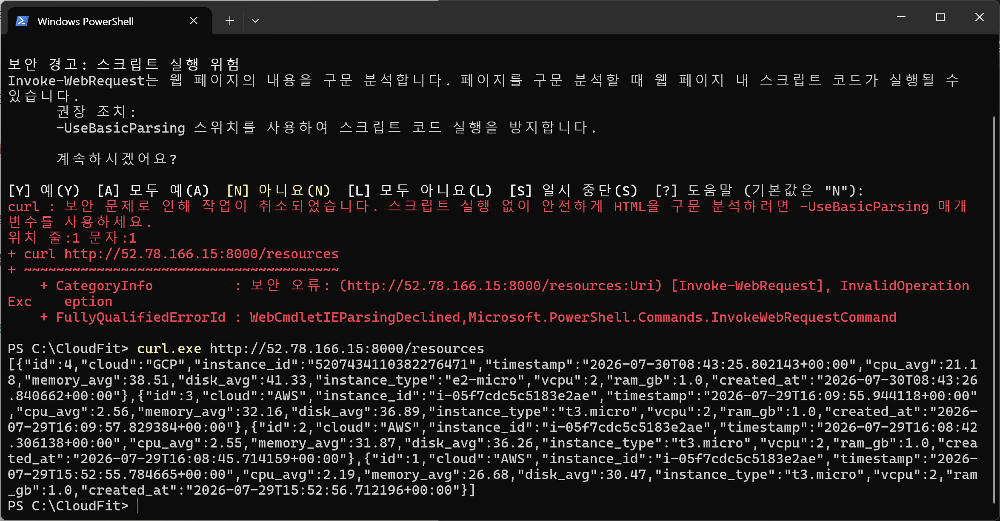
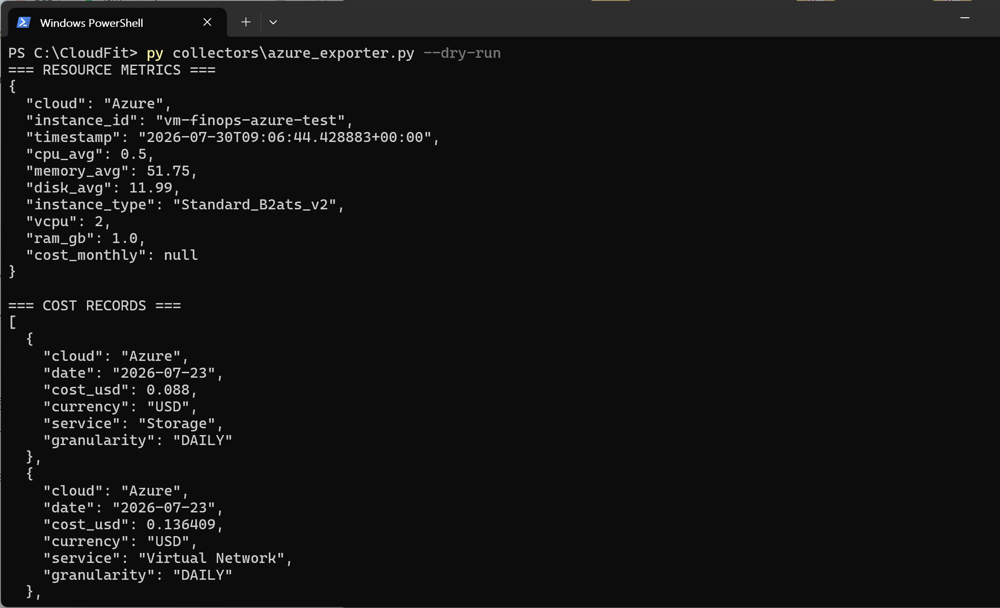
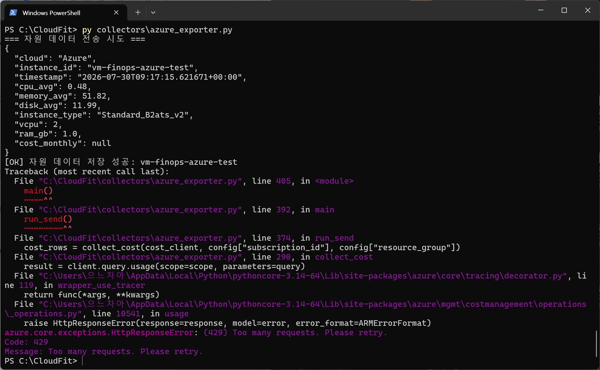
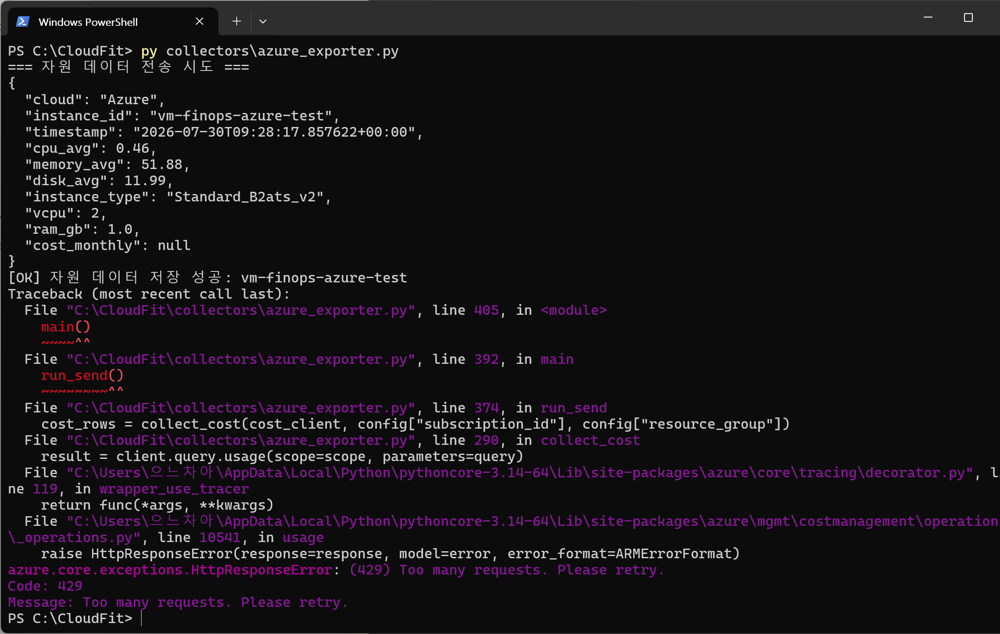
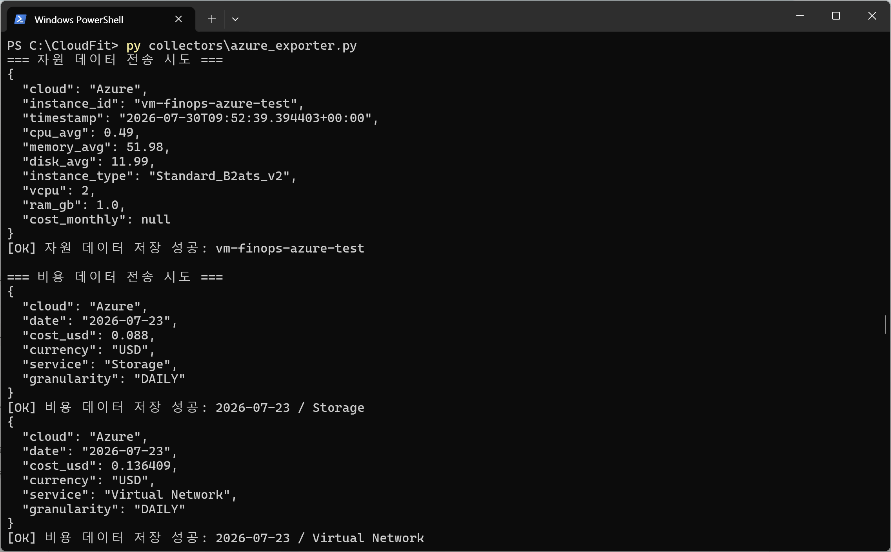
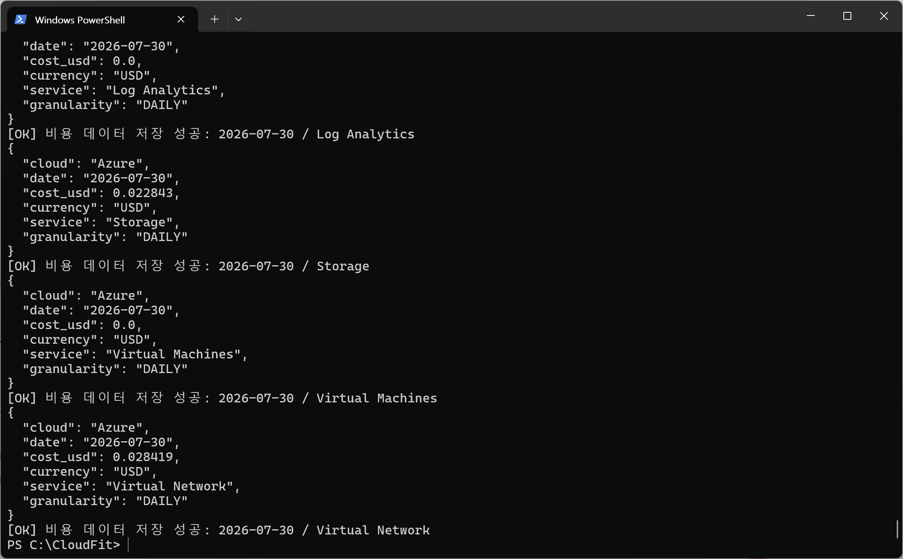

# 2026-07-30 — Week 5 (Day 1~2)

## 오늘 목표
- `azure_exporter.py`의 `SERVER_URL`을 하드코딩된 ngrok 주소에서 `.env` 기반으로 변경
- `.env`에 EC2 Public IP 반영 후 EC2 서버 연결 테스트
- 자원 데이터 + 비용 데이터 EC2 서버 전송 확인
- CPU 수집 구간을 AWS/GCP와 동일하게 1시간으로 통일 (기존 30분)
- ngrok 전용 헤더(`ngrok-skip-browser-warning`) 제거
- 비용 API 429 에러 Incident 문서화

## 오늘 한 일
- `azure_exporter.py` 최상단에 `load_dotenv()` + `SERVER_URL = os.getenv("SERVER_URL", ...)` 추가, 하드코딩된 ngrok URL 삭제
- `load_config()` 내부의 중복 `load_dotenv()` 호출 제거
- `.env`에 `SERVER_URL=http://52.78.166.15:8000` 추가
- `curl.exe`로 EC2 서버 연결 확인 (`/resources` 정상 응답, GCP/AWS 기존 데이터 확인됨)
- `--dry-run`으로 Azure 자원 메트릭 정상 수집 확인 (`vm-finops-azure-test`)
- 실제 전송(`py collectors\azure_exporter.py`) 실행
  - 자원 데이터: 매번 성공
  - 비용 데이터: 첫 2회 `429 Too Many Requests` 발생, 약 25분 대기 후 재시도하여 성공
- `DEFAULT_LOOKBACK_MINUTES`를 30 → 60으로 변경 (AWS/GCP와 CPU 평균 집계 구간 통일)
- `send_resource_to_server()`, `send_cost_to_server()`에서 `ngrok-skip-browser-warning` 헤더 삭제
- `incidents/INC-001-azure-cost-api-429.md` 작성 (429 원인, 타임라인, 복구 과정, 재발 방지 방안 정리)
- stress-ng 5분 패턴 테스트는 이번 주 보류 결정 (CPU 평균 집계 단위가 1시간이라 5분 부하로는 평균값에 유의미한 변화가 없다고 판단)

## 왜 이 기술/방법을 선택했는가

| 항목 | 선택한 것 | 대안 | 선택 이유 |
|------|-----------|------|-----------|
| 서버 주소 관리 | `.env` + `os.getenv()` | 코드에 하드코딩 | EC2 IP가 바뀌어도 코드 수정 없이 `.env` 한 줄만 바꾸면 되도록 하기 위해 |
| `SERVER_URL` 위치 | 모듈 최상단 전역변수 | `load_config()` 안에 포함 | 전송 함수들이 Azure 인증 설정과 무관하게 독립적으로 값을 참조해야 해서, 인증 정보와 전송 설정의 역할을 분리하기 위해 |
| CPU 평균 구간 | 60분 | 기존 30분 유지 | AWS/GCP가 이미 1시간 기준으로 평균을 내고 있어서, 클라우드 간 공정 비교를 위해 구간을 통일함 |
| 429 대응 | 대기 후 수동 재시도 (이번 주만) | 즉시 재시도/백오프 로직 구현 | Azure Cost Management API의 분당 4회 제한이 확인됐고, 오늘은 시간 문제상 임시로 대기 후 재시도로 우회, 백오프 로직은 차주 반영 검토로 미룸 |
| stress-ng 부하 시간 | 이번 주 보류 | 계획대로 5분 부하 진행 | CPU 평균이 1시간 단위로 집계되어 5분 부하가 평균값에 거의 반영되지 않아, ML 학습 데이터로서 효과가 낮다고 판단함 |

## 오늘 처음 안 사실

| 몰랐던 것 | 알게 된 것 | 왜 그렇게 되는지 |
|-----------|-----------|----------------|
| Azure Cost Management API 429 원인 | 스코프(구독)당 분당 4회라는 공식 호출 제한이 있음 | Azure Plan 등 구독 유형과 무관하게 API 자체에 걸린 하드 리밋이기 때문 (Microsoft 공식 Q&A로 확인) |
| Python trailing comma | 여러 줄로 나눠 쓰는 함수 호출에서 마지막 인자 뒤에도 콤마를 붙이는 관례가 있음 | 나중에 인자를 추가/삭제할 때 Git diff가 해당 줄만 깔끔하게 표시되도록 하기 위해 |
| Markdown 이미지 문법 누락 | `evidence/파일명.png`처럼 텍스트로만 적으면 GitHub에서 이미지가 안 보임 | `` 형태의 실제 이미지 문법이 있어야 렌더링됨. 6/24 diary는 정상, 7/3 이후 diary부터 이 문법이 빠져있던 것을 확인함 |

## 결과·증거
- 캡처: `evidence/week5-azure-server-connection-ok.png`

- 캡처: `evidence/week5-azure-dryrun-ok.png`

- 캡처: `evidence/week5-azure-cost-429-fail-1.png`

- 캡처: `evidence/week5-azure-cost-429-fail-2.png`

- 캡처: `evidence/week5-azure-send-ok-1.png`

- 캡처: `evidence/week5-azure-send-ok-2.png`

- Incident 문서 작성 완료: `incidents/INC-001-azure-cost-api-429.md`

## 막힌 점
- 비용 데이터 전송 시 `429 Too Many Requests` 에러가 2회 연속 발생했다.
  - 원인: Azure Cost Management API의 스코프당 분당 4회 호출 제한을 짧은 시간 안에 초과함 (`--dry-run` + 실전송 반복 실행으로 누적)
  - 복구: 약 25분 대기 후 재실행하여 자원+비용 데이터 모두 정상 전송됨
  - 남은 과제: 재시도/백오프 로직 코드 반영 및 자원-비용 수집 주기 분리 여부를 차주 계획 확인 후 결정하기로 함 (Incident 문서에 기록)

## 혼자 다시 할 수 있나? (커밋 전 자문)
- [x] Yes → 커밋