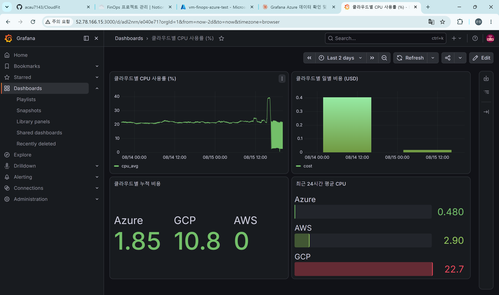
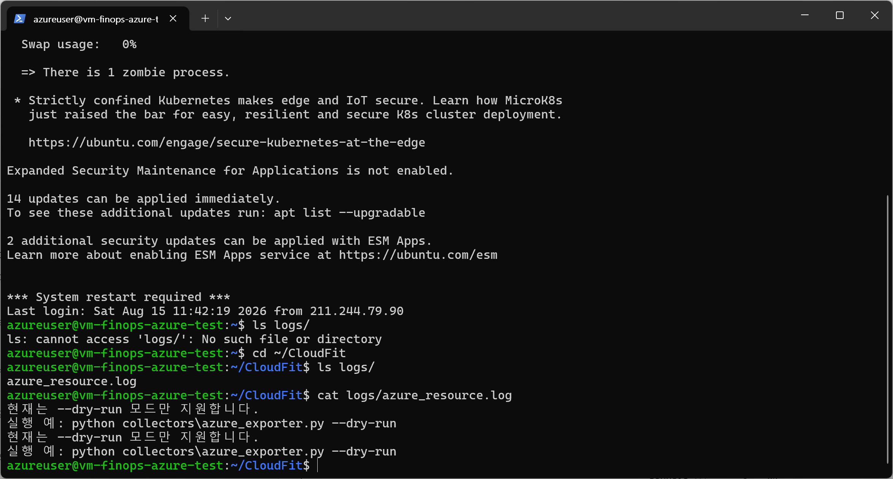
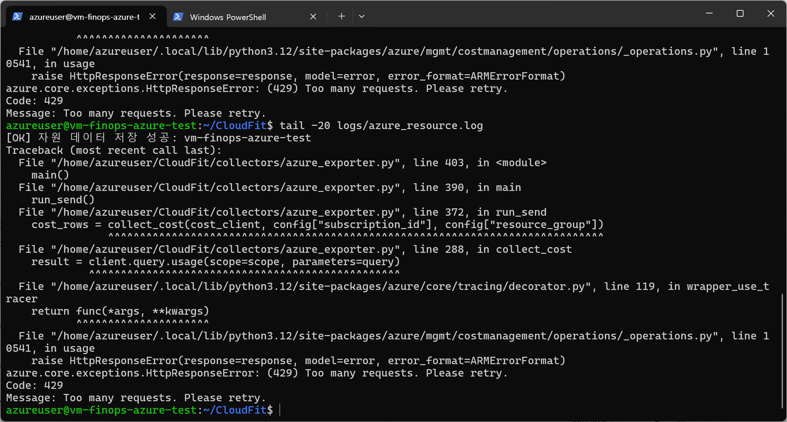
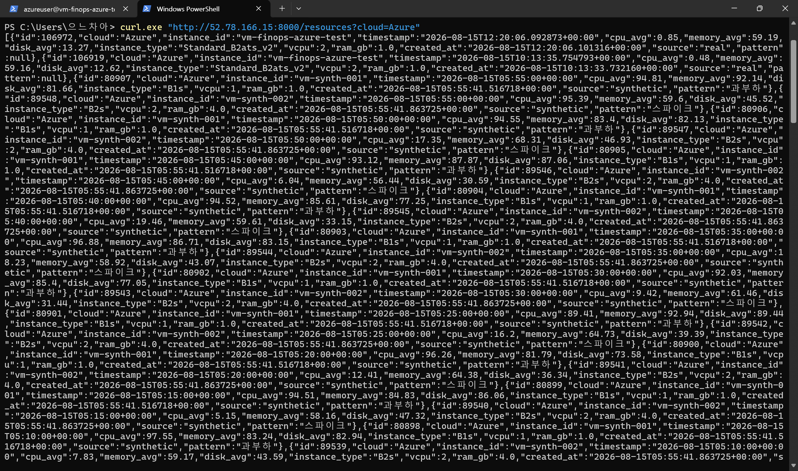

# 2026-08-15 — Week 06 (Day 1~3)

## 오늘 목표
- Grafana 대시보드에서 Azure 데이터가 정상 표시되는지 확인 (Day 1~2)
- Azure VM에 cron을 설정해 자원/비용 수집을 자동화 (Day 2~3)

## 오늘 한 일
- `curl`로 `/resources?cloud=Azure`, `/costs?cloud=Azure` 응답 확인 → 데이터는 있으나 7/30 시점의 오래된 데이터임을 확인 (5주차 이후 자동 수집이 없었기 때문)
- Grafana(`http://52.78.166.15:3000`) 접속 시도 → 최초 `ERR_CONNECTION_TIMED_OUT` 확인, A에게 문의 → A가 대시보드 완성 후 재접속 성공
- Grafana "클라우드별 CPU 사용률", "최근 24시간 평균 CPU" 패널에서 Azure 항목이 비어 있는 것을 확인 → 원인은 패널 설정이 아니라 **실제 수집기가 최근 데이터를 전송한 적이 없었기 때문**으로 확인
- GitHub PAT("finops") 만료 대응: 신규 토큰 발급 후 `git remote set-url`로 교체, 인증 정상화 확인 (`git remote -v`)
- 로컬에서 `azure_exporter.py` 수동 실행 → 자원 데이터 전송 성공(`[OK]`), 비용 데이터는 429(Too Many Requests)로 실패 — 이미 known issue(INC-001)와 동일 패턴
- MobaXterm 대신 Windows PowerShell 내장 SSH로 Azure VM(`vm-finops-azure-test`) 접속 성공 (`.pem` 키 사용)
- VM 환경 셋업: `~/CloudFit/collectors/azure_exporter.py`는 존재했으나 `.env` 파일 부재 확인 → 로컬 `.env`를 `scp`로 VM에 전송
- VM에 Python 패키지 설치 (`pip3` 부재 → `python3-pip` 설치 → PEP668 `externally-managed-environment` 에러 → `--break-system-packages`로 우회하여 azure-identity 등 필요 패키지 설치)
- `requirements` 파일이 로컬에는 확장자 없이(`requirements`, `.txt` 아님) 존재해 VM에서 `pip install -r requirements.txt` 실패 → 개별 패키지명으로 직접 설치하는 방식으로 우회 (파일명 정리는 추후 별도 처리 필요)
- **중요 발견**: VM의 `azure_exporter.py`가 4주차 이전의 예전 버전이었음을 발견 (`--dry-run` 없이 실행 시 "현재는 --dry-run 모드만 지원합니다" 출력 후 종료되는 구조 — 4주차에 이미 삭제하기로 했던 코드). 로컬 최신 파일을 `scp`로 재전송하여 VM 코드 최신화
- `logs` 디렉토리 생성 후 `crontab -e`로 5분 주기 자원 수집 + 매일 09:00 비용 수집 작업 등록
- cron 자동 실행 확인: `logs/azure_resource.log`에 `[OK] 자원 데이터 저장 성공` 기록 확인, 서버 `curl` 조회로 최신 timestamp(12:20) 데이터 도달까지 검증 완료
- Day 4(stress-ng 부하 패턴 생성)는 5주차에 이미 내린 결정(1시간 lookback 평균으로 인해 5분 단위 부하가 통계적으로 희석되어 무의미)이 여전히 유효하다고 판단하여 스킵. 대신 팀원이 이미 비교용으로 넣어둔 `vm-synth-001/002` 합성 데이터(5분 단위 개별 레코드, "과부하"/"스파이크" 패턴 태그 포함)가 ML 학습 목적에는 더 적합한 것으로 확인

## 왜 이 기술/방법을 선택했는가
| 항목 | 선택한 것 | 대안 | 선택 이유 |
|------|-----------|------|-----------|
| VM 접속 방법 | PowerShell 내장 SSH | MobaXterm | Windows 10/11에 OpenSSH 클라이언트가 기본 내장되어 있어 별도 도구 설치 없이 바로 사용 가능 |
| 패키지 설치 방식 | `pip3 install --break-system-packages` | `python3 -m venv`로 가상환경 구성 | 이 VM은 수집기 전용 서버라 시스템 파이썬과 충돌 위험이 낮고, cron 등록 시 venv 경로를 별도로 지정하는 번거로움을 피하기 위함 |
| Day 4 진행 여부 | 스킵 | stress-ng로 실제 부하 발생 | `DEFAULT_LOOKBACK_MINUTES=60` 설계상 5분 부하가 1시간 평균에 거의 반영되지 않아 실효성이 낮음 (5주차 decisions 참고) |

## 오늘 처음 안 사실
| 몰랐던 것 | 알게 된 것 | 왜 그렇게 되는지 |
|-----------|-----------|----------------|
| Azure Portal Cloud Shell과 로컬 SSH의 차이 | Cloud Shell은 Azure 관리용 별도 컨테이너로, 여기서 crontab을 설정해도 VM에는 반영되지 않음 | VM 내부 설정(crontab)은 VM에 직접 SSH로 접속해야만 적용됨 |
| Ubuntu 24.04의 pip 정책 | 시스템 전역에 pip install이 기본적으로 막혀 있음 (PEP 668) | 시스템 파이썬 환경 보호를 위한 정책, `--break-system-packages`로 우회 가능 |
| VM 코드가 로컬과 동기화되지 않을 수 있다는 것 | VM에 처음 배포한 시점 이후 로컬에서 진행한 수정사항(4주차 dry-run 분기 정리 등)이 VM에는 반영되지 않고 있었음 | git pull이나 파일 재배포를 하지 않으면 VM은 배포 시점의 코드 상태로 고정됨 |
| 서버 응답의 `source` 필드 | `real`/`synthetic`으로 실제 데이터와 합성 데이터가 이미 구분되어 있음 | Grafana나 분석 로직에서 `source=real` 필터링으로 합성 데이터 혼입 문제를 해결할 수 있음 |

## 결과·증거

**Grafana "최근 24시간 평균 CPU" 패널에 Azure(0.480) 첫 표시 확인**

**VM의 예전 버전 코드로 인한 실패 상태 ("dry-run 모드만 지원" 반복 출력)**

**VM 코드 최신화 후 복구 확인**
> 캡처 누락 — VM에서 최신 `azure_exporter.py`로 재전송 직후 `--dry-run` 재실행 시 "dry-run 모드만 지원합니다" 문구가 사라진 것을 화면으로 확인했으나, 캡처를 남기지 못함. 이후 cron 자동 실행 성공(아래 항목)으로 간접 확인됨. 재현 명령어: `python3 collectors/azure_exporter.py --dry-run`

**cron 자동 실행 첫 성공 (`[OK] 자원 데이터 저장 성공`)**

**서버 최종 도달 확인 (timestamp 12:20:06, source: real)**

## 막힌 점
- `cloud=Azure` 필터 요청이 간헐적으로 500 에러를 반환하는 현상 발견 (재현이 매번 되지는 않음, 서버 로그 확인 필요 — 팀 공유 완료, 원인 미상 상태로 보류)
- `requirements` 파일이 확장자 없이 저장되어 있어 표준 설치 명령(`pip install -r requirements.txt`)이 동작하지 않음 (추후 `.txt`로 리네임 후 커밋 필요)
- `azure_exporter.py`의 `run_dry_run()` 함수는 비용 수집을 자원 수집 출력보다 먼저 시도하는 구조라, 429 에러 발생 시 자원 데이터 확인이 불가능함 (코드 개선 필요, 급하지 않음)
- VM 코드 최신화 직후 복구 확인 캡처를 놓침 (evidence 섹션에 "캡처 누락"으로 명시, 추후 재현 가능 시 교체 예정)

## 혼자 다시 할 수 있나? (커밋 전 자문)
- [x] Yes → 커밋