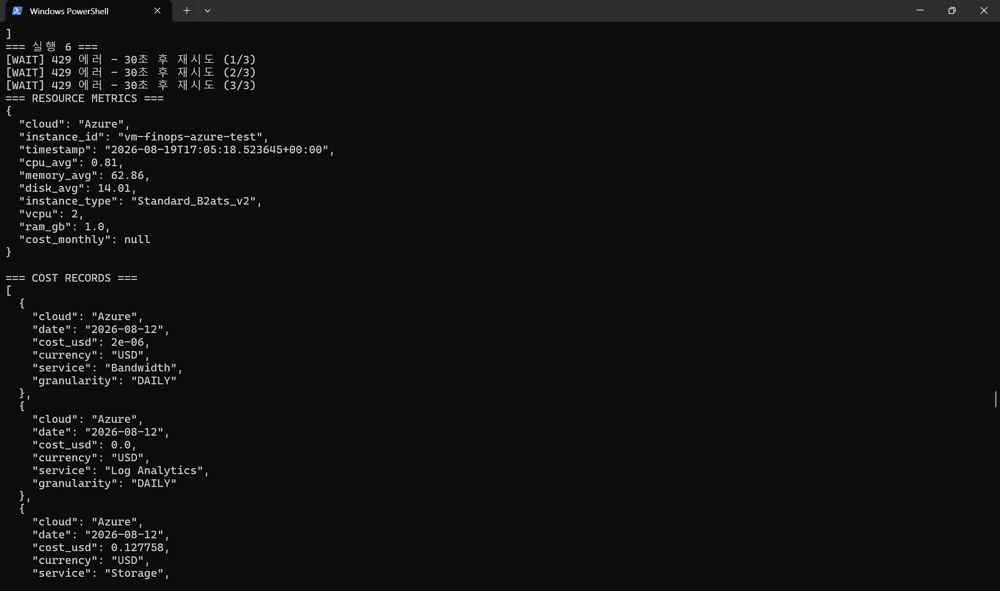
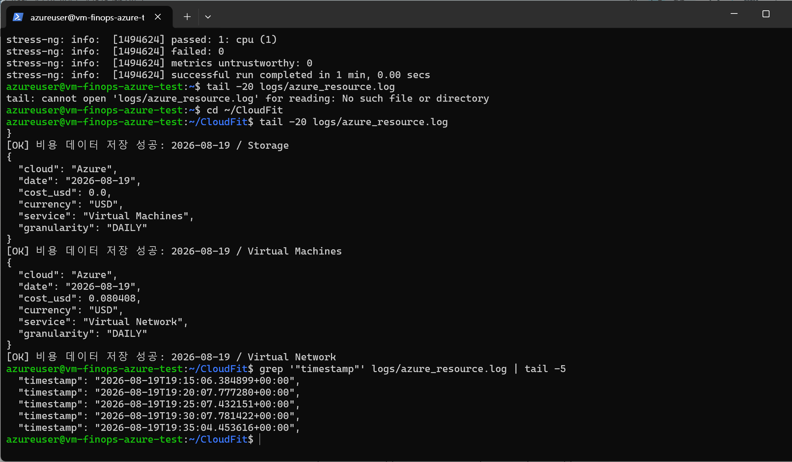
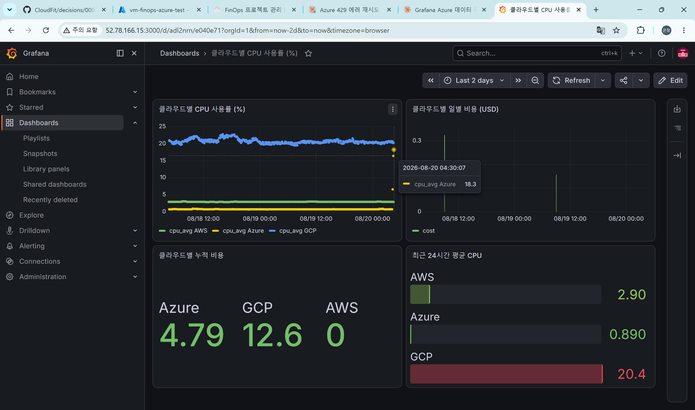
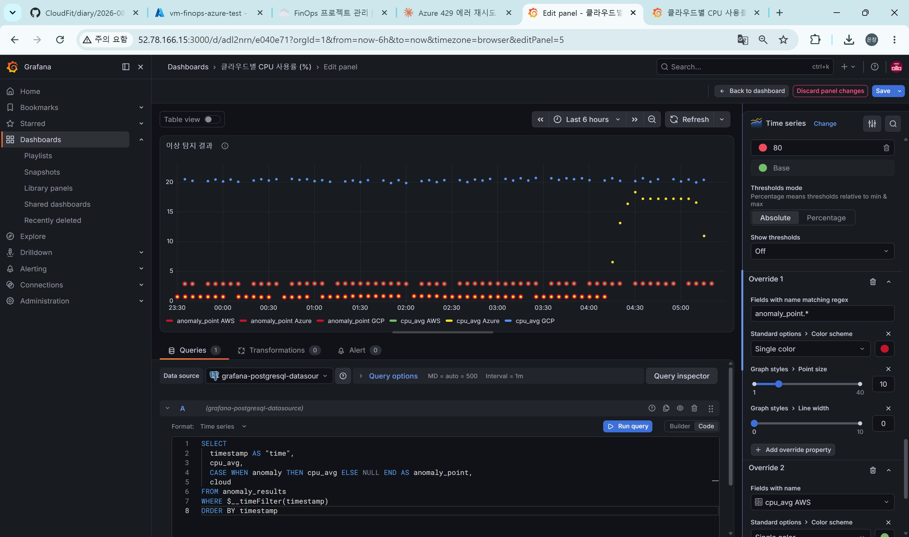

# 2026-08-20 — Week07 (B)

## 오늘 목표
- Azure Cost Management API 429 에러(INC-001) 대응: `collect_cost()`에 재시도 로직 추가
- stress-ng로 점진적 증가 / 간헐적 스파이크 부하 패턴 생성 (ML 학습 데이터용)
- Grafana에 이상탐지 결과 패널 추가 (빨강 = 이상)

## 오늘 한 일
- `collect_cost()`에 429 재시도 로직 추가 (`max_retries=3`, `Retry-After` 헤더 기반 대기, 429 외 에러는 즉시 raise)
- 로컬 `--dry-run` 8회 반복 실행으로 429 유발 테스트 → 6번째 실행에서 `(1/3)→(2/3)→(3/3)` 재시도 후 정상 복구 확인
- Azure VM에서 stress-ng 패턴 4(점진적 증가, 1~4코어 x 120s)와 패턴 5(간헐적 스파이크, 4코어 30s / 1코어 60s x 3회) 실행
- cron(5분 주기, 6주차에 이미 구축 완료된 것 확인)이 부하 구간을 정상적으로 수집했는지 `grep timestamp`로 검증 → Grafana에서 `cpu_avg Azure` 13.1 → 18.3으로 점진적 상승 확인
- A의 Week07 diary 확인: `anomaly_results` 테이블, Isolation Forest 클라우드별 모델, `/anomalies` API 이미 구축되어 있음을 확인
- Grafana에 새 패널("이상 탐지 결과") 추가: PostgreSQL 쿼리로 `anomaly_point`(이상 시점만 값, 나머지 NULL) 필드 생성, Override로 anomaly_point는 빨강 고정 + Point size 10 + Line width 0(점만 표시), cpu_avg는 기존 패널과 색 통일(AWS=초록/Azure=노랑/GCP=파랑)

## 왜 이 기술/방법을 선택했는가
| 항목 | 선택한 것 | 대안 | 선택 이유 |
|------|-----------|------|-----------|
| 429 대응 | 재시도(완화) + 인터벌 분리는 별도 백로그(해결) | 재시도만으로 끝냄 | 원인 자체는 호출 빈도이므로, 재시도는 임시방편임을 명확히 구분해서 기록 (decisions/0008) |
| anomaly_point 표시 방식 | Point size↑ + Line width=0 | 기본 Time series 스타일 그대로 | cpu_avg 실선과 겹칠 때 anomaly_point가 선으로 이어지면서 "쭉 이어진 이상 상태"처럼 보이는 착시가 생겨, 점만 남겨 개별 이상 시점을 명확히 구분 |
| cpu_avg 색상 | 기존 패널과 수동으로 색 통일 | Grafana 자동 배색(palette-classic) 그대로 둠 | 같은 지표를 다른 패널에서 다른 색으로 보여주면 대시보드 전체를 볼 때 혼란을 줌 |

## 오늘 처음 안 사실
| 몰랐던 것 | 알게 된 것 | 왜 그렇게 되는지 |
|-----------|-----------|----------------|
| Grafana 필드 색상은 패널마다 독립적으로 자동 배정되는 줄 몰랐음 | 같은 필드명(cpu_avg AWS 등)이라도 패널마다 순서가 다르면 자동 배색 결과가 달라짐 | palette-classic 모드는 override가 없으면 쿼리 결과에 필드가 나타나는 순서대로 색을 배정하기 때문 |
| anomaly_point 정규식을 `^anomaly_point`로 좁히면 오히려 문제가 생김 | `^anomaly_point`는 override 자체를 무력화시켜 다른 패널 색을 그대로 물려받게 함 | override가 좁아진 게 아니라, 의도한 Fixed color 지정이 아예 안 걸리는 방식으로 정규식이 다르게 해석됨 |

## 결과·증거
- `evidence/week07-azure-429-retry-ok.png` (429 3연속 → 재시도 → 정상 복구)
- `evidence/week07-cron-stress-timestamps-ok.png` (stress-ng 구간 cron 수집 타임스탬프)
- `evidence/week07-grafana-azure-cpu-spike-ok.png` (Grafana에서 13.1→18.3 상승 확인)
- `evidence/week07-anomaly-panel-ok.png` (이상탐지 패널 최종 완성 화면, 빨간 점 다수 표시)

## 막힌 점
- Grafana 새 패널 만드는 과정에서 UI 위치(Add panel 버튼, Builder/Code 전환, Override 추가 경로)를 여러 번 헤맴 — 스크린샷 기반으로 하나씩 확인하며 진행
- **이상탐지 패널을 만들고 나서, AWS/Azure 거의 전 시간대(6시간 전체)가 `anomaly:true`로 찍히는 것을 발견함.** 처음엔 "수집 재개 직후 일시적 과탐지"로 추정했으나, 확인해보니 범위가 훨씬 넓어서 일시적 현상이 아닌 것으로 보임.
  - **가설**: 지금 우리 Azure VM은 실제 서비스 트래픽 없이 거의 유휴 상태로만 존재해서, CPU 사용률이 시간대와 무관하게 항상 낮고 평평하게 유지됨. 실제 운영 환경이라면 트래픽에 따라 사용률이 오르내리는 변동폭이 정상적으로 존재할 텐데, 지금은 그 변동 자체가 거의 없다 보니 Isolation Forest가 "이 저사용률·저변동 패턴 자체"를 이상으로 학습했을 가능성이 있음. 즉 모델이 잘못된 게 아니라, **학습 데이터가 유휴 상태 위주로 편향되어 있어서 정상 기준선 자체가 왜곡됐을 수 있음.**
  - A에게 이 관찰과 가설을 공유함. 학습 데이터 구성(유휴 구간 비중)을 같이 확인해달라고 요청.

## 혼자 다시 할 수 있나? (커밋 전 자문)
- [x] Yes → 커밋