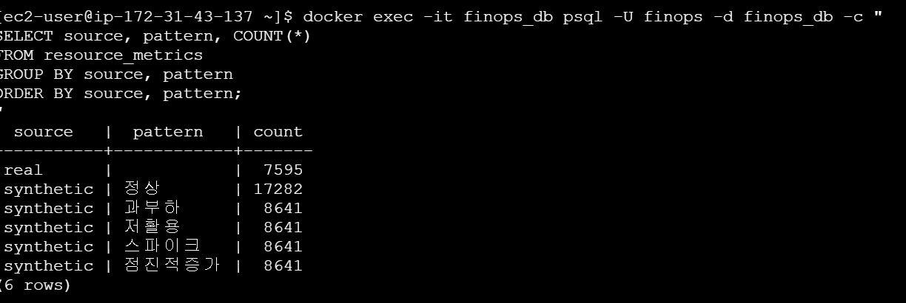
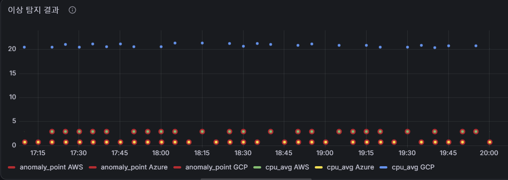
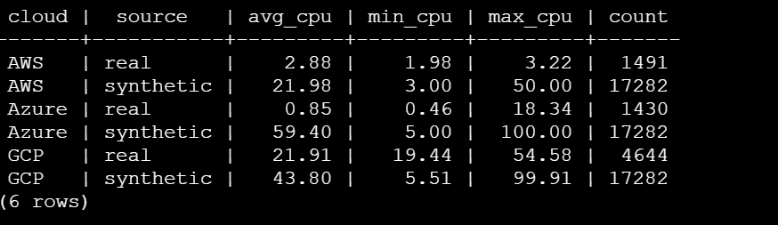

# 2026-08-20 — Day 12 (GCP 담당)

> 확인 과정에서 새로운 버그(AWS/Azure 이상탐지 100% 오탐)를 발견해서 원인 규명 + INC-002 작성까지 진행함.

## 오늘 목표
- `db/schema.sql`을 A가 추가한 `anomaly_results` 테이블과 병합하고, 라이브 DB와 일치하는지 검증
- synthetic 데이터(51,846건)가 그 사이 오염/유실되지 않았는지 재확인
- 7주차 마지막 항목: Grafana 이상탐지 패널에서 GCP 데이터 확인 + `/anomalies` API 테스트

## 오늘 한 일
- A가 새로 올린 `db/schema.sql`(`anomaly_results` 테이블 + `cost_records` UNIQUE 제약 추가)을 내 로컬 스키마(`source`/`pattern` 컬럼 포함 버전)와 병합
- 병합한 파일을 라이브 DB(`\d resource_metrics`, `\d cost_records`, `\d anomaly_results`)와 대조 → 3개 테이블 전부 일치 확인
- `resource_metrics`를 `source`, `pattern`별로 재조회해서 synthetic 51,846건이 그대로 보존돼 있는지 확인 (real은 cron으로 계속 늘어나는 중, 정상)
- 패널 확인 중 AWS/Azure는 매 시점 100% 이상 판정, GCP는 0% 판정되는 역전 현상 발견
- `anomaly_results` ↔ `resource_metrics` JOIN으로 실시간 탐지 저장 단계는 오염 없음(전부 real) 확인 → 원인이 학습 단계로 좁혀짐
- `resource_metrics`를 `cloud`×`source`로 그룹핑해 평균 CPU 비교 → synthetic이 real보다 최대 70배(Azure) 높다는 것 확인, 근본 원인 확정
- `incidents/INC-002.md` 작성 (Summary/Severity/Impact/Detection/Timeline/Symptoms/Root Cause/Recovery/Prevention/Evidence)

## 왜 이 기술/방법을 선택했는가
| 항목 | 선택한 것 | 대안 | 선택 이유 |
|------|-----------|------|-----------|
| schema.sql 병합 방식 | 두 버전 다 반영 후 라이브 DB로 재검증 | A 파일로 그냥 덮어쓰기 | 덮어쓰면 내가 추가한 `source`/`pattern` 컬럼이 사라짐. 파일과 실제 DB가 다를 수 있다는 걸 6주차에 이미 겪어서, 이번엔 병합 후 반드시 DB 대조까지 함 |
| `main` 브랜치 상태를 GitHub API로 직접 조회 | `raw.githubusercontent.com`/`api.github.com`으로 파일 내용 직접 확인 | 팀원에게 구두로 물어보기 | 실제 파일 상태를 즉시, 정확하게 확인 가능. 팀원 기억에 의존하지 않아도 됨 |
| 버그 발견 후 코드부터 안 고치고 Incident 문서 먼저 작성 | 원인 규명 → 문서화 → 그 다음 수정 | 바로 `train.py` 고치고 재학습 | 추측만으로 고치면 "왜 고쳤는지" 근거가 안 남음. Incident 문서 자체가 A한테 전달할 근거 자료 역할을 함 |

## 결과·증거
- `schema.sql` 병합 + 라이브 DB 3개 테이블(`resource_metrics`, `cost_records`, `anomaly_results`) 전부 일치 확인

- synthetic 데이터 51,846건(5개 패턴) 무결성 확인, real은 cron으로 계속 증가 중(3,925 → 4,644+) 확인

  

- `week08-plan.md` 작성 완료 (ML 데이터 소스 분리 + synthetic 검증을 최우선 항목으로)
- `incidents/INC-002.md` 작성 완료 — AWS/Azure 100% 오탐 / GCP 0% 오탐 원인을 synthetic 데이터 오염으로 규명

  

  

- 캡처 파일 목록 (전부 `week07-` 접두어로 통일):
  - `evidence/week07-schema-merge-verified-ok.png`
  - `evidence/week07-synthetic-integrity-ok.png`
  - `evidence/week07-anomaly-100pct-bug-detected.png`
  - `evidence/week07-root-cause-query-result.png`

## 막힌 점
- `ml/train.py`는 A 담당 파일이라 직접 고치지 않고 INC-002 문서로 A한테 전달하기로 함 — 아직 재학습 전이라 `/anomalies` API와 Grafana 이상탐지 패널 결과는 여전히 신뢰할 수 없는 상태로 남아있음

