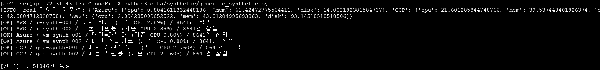
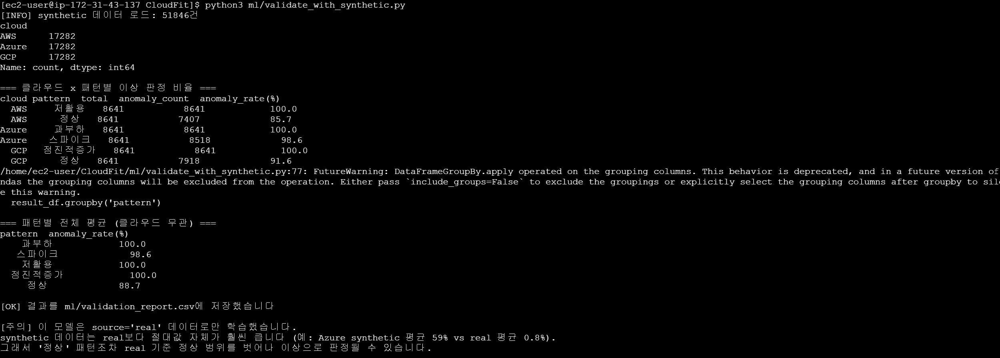
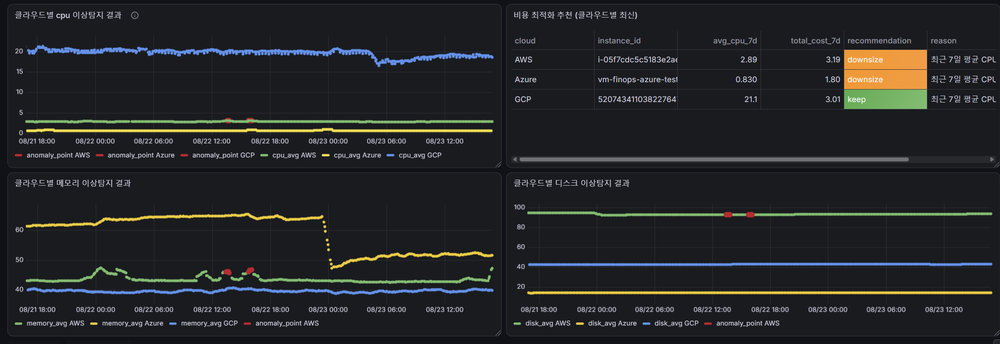

# 2026-08-23 — week08

## 오늘 목표
- synthetic 데이터의 스케일 불일치 문제(정상 패턴도 이상으로 찍히는 현상) 원인 파악 및 1차 개선
- Grafana에 메모리·디스크 이상탐지 패널 추가 (CPU 패널과 동일한 구조로)

## 오늘 한 일
- `ml/validate_with_synthetic.py` 실행 결과, "정상" 패턴을 포함한 모든 synthetic 패턴이 99.7~100%로 이상 판정되는 것을 확인 → 원인 분석
- 원인: `data/synthetic/generate_synthetic.py`의 `PATTERNS`가 모든 클라우드에 동일한 절대값(예: 정상=CPU 20~50%)을 쓰고 있었음. 실제로는 클라우드마다 평소 CPU 수준이 다름(AWS 2.9%, Azure 0.8%, GCP 21.8%)
- `generate_synthetic.py`를 v2로 재작성: 절대값 대신 "클라우드별 real 데이터 평균 대비 배율"로 패턴 정의 (`fetch_real_baseline()` 추가)
- 기존 synthetic 데이터 전부 삭제 후 v2로 재생성 (51,846건) → `validate_with_synthetic.py` 재실행

  

  - 결과: "정상" 패턴 anomaly_rate가 AWS 87.2%, GCP 90.6%로 나머지 패턴(100%)과 격차가 처음으로 발생함. 완전히 해결된 건 아니지만 "전혀 구분 못 함" → "정상이 그나마 덜 이상하게 나옴"으로는 진전

    

  - 남은 원인: 노이즈 폭(평균의 ±30%)이 real 표준편차보다 훨씬 넓어서 여전히 이상치로 보임 → 오늘은 보류, 다음에 표준편차 기반으로 노이즈 폭 좁히는 작업 필요
- A가 `anomaly_detector.py`에 memory_avg/disk_avg 저장 로직을 반영하고 `--full` 재계산까지 완료한 것을 DB에서 확인 (`anomaly_results` 10,024건에 memory_avg 채워짐)
- Grafana 대시보드에 메모리·디스크 이상탐지 패널 추가
  - 기존 CPU 패널(`이상 탐지 결과`)과 동일하게 Query A(실측값, `source='real'`) + Query B(`anomaly_results`에서 `anomaly=true`인 것만, alias `anomaly_point`) 2-쿼리 구조로 구성
  - Field override로 `anomaly_point.*` 정규식에 Style=Points, Show points=Always, Line width=0 적용해서 이상 시점에만 빨간 점이 찍히도록 설정
  - 패널 이름을 `클라우드별 메모리 이상탐지 결과` / `클라우드별 디스크 이상탐지 결과`로 통일 (CPU 패널명 컨벤션에 맞춤)

  
- 팀 미팅 체크리스트 작성 및 진행 (INC-002 공유, schema.sql 병합본 공유, WBS 갱신 확인 등)

## 왜 이 기술/방법을 선택했는가
| 항목 | 선택한 것 | 대안 | 선택 이유 |
|------|-----------|------|-----------|
| synthetic 데이터 생성 방식 | 클라우드별 real 평균 대비 배율(multiplier) | 고정 절대값 유지 / 표준편차까지 한 번에 반영 | 클라우드마다 스케일이 달라서 절대값 방식은 근본적으로 안 맞음. 표준편차까지 반영하는 건 범위가 더 커서 이번엔 평균 기준 배율만 우선 적용하고 표준편차는 다음으로 보류 |
| Grafana 이상탐지 오버레이 방식 | 기존 CPU 패널과 동일하게 Query A(실측값)+Query B(anomaly_point) 2-쿼리, Points 스타일 | Grafana Alert Rule이나 Annotation 기능 사용 | 이미 CPU 패널에서 검증된 패턴이 있어서 그대로 복제하는 게 팀 컨벤션 유지에도 좋고 구현도 빠름 |

## 오늘 처음 안 사실
| 몰랐던 것 | 알게 된 것 | 왜 그렇게 되는지 |
|-----------|-----------|----------------|
| synthetic 정상 패턴이 왜 여전히 이상으로 찍히는지 | 평균만 맞추고 흔들림 폭(표준편차)은 안 맞춰서, real의 좁은 변동폭 기준으로 보면 여전히 크게 벗어난 값으로 보임 | StandardScaler가 real 데이터의 좁은 표준편차를 기준 삼아 정규화하는데, AWS real 표준편차는 0.07밖에 안 되는 반면 synthetic 정상의 흔들림 폭은 그보다 훨씬 넓어서(약 13배) 절대값은 비슷해도 스케일 정규화 후엔 극단적 이상치로 계산됨 |

## 결과·증거
- 캡처: `evidence/week08-synthetic-v2-regenerate-ok.png` (배율 방식 재생성 로그, 클라우드별 기준 CPU 확인)
- 캡처: `evidence/week08-validate-synthetic-v2-result.png` (재검증 결과 - 정상 패턴만 anomaly_rate 격차 발생)
- 캡처: `evidence/week08-dashboard-memory-disk-anomaly-ok.png` (완성된 대시보드 - CPU/메모리/디스크 이상탐지 + 비용 추천 패널)

## 막힌 점
- synthetic "정상" 패턴의 표준편차 미반영 문제는 원인만 파악하고 오늘은 보류하기로 함 (다음 작업으로 이월)
- decisions/0009는 반영 완료된 걸로 확인됐지만, 현재는 `cpu_avg` 기준으로만 판정함 — `memory_avg`/`disk_avg`는 `anomaly_results`에 저장만 되고 판정 기준에는 아직 포함 안 됨. 확장할지 여부는 A와 협의 필요

